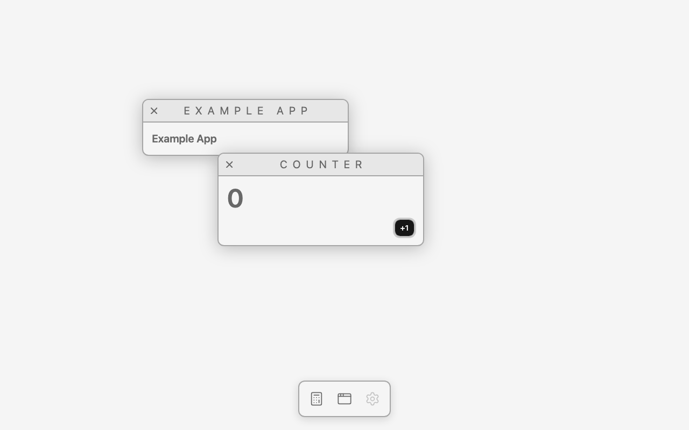
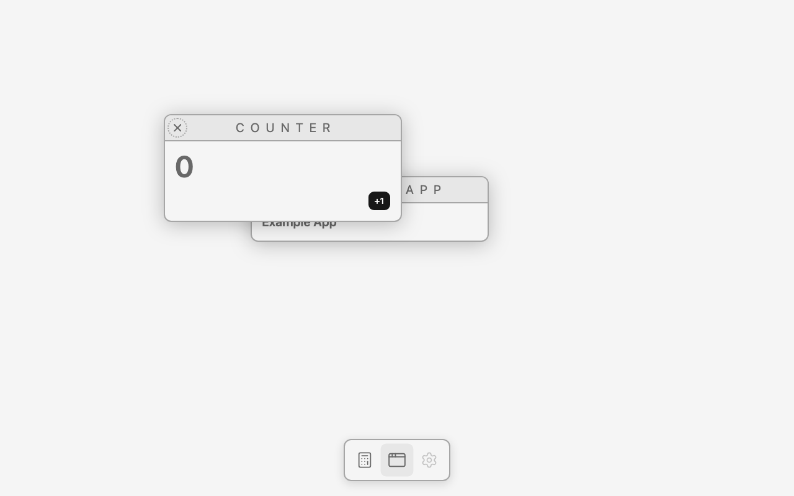
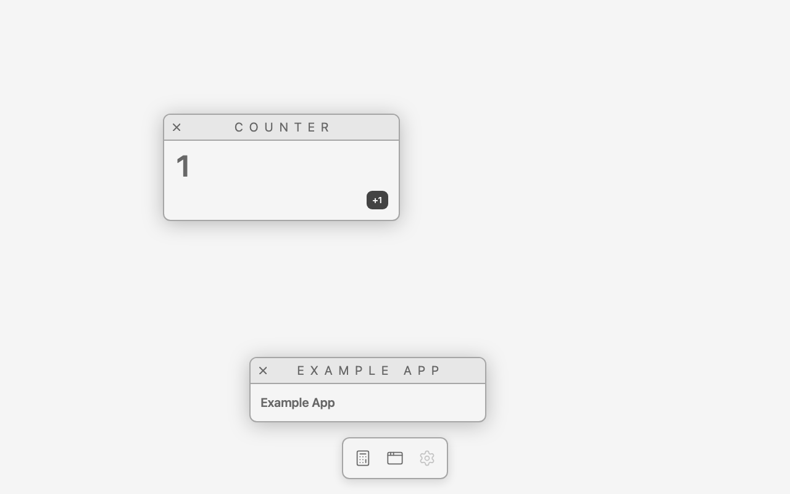
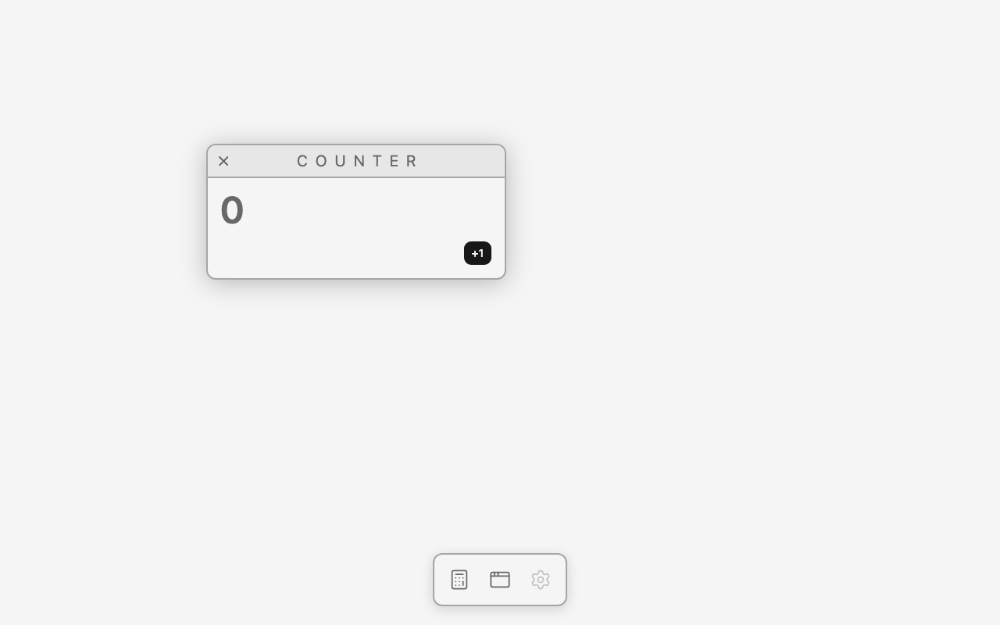
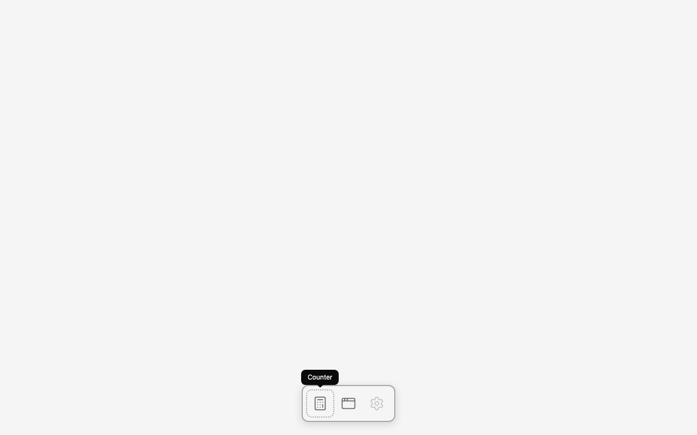
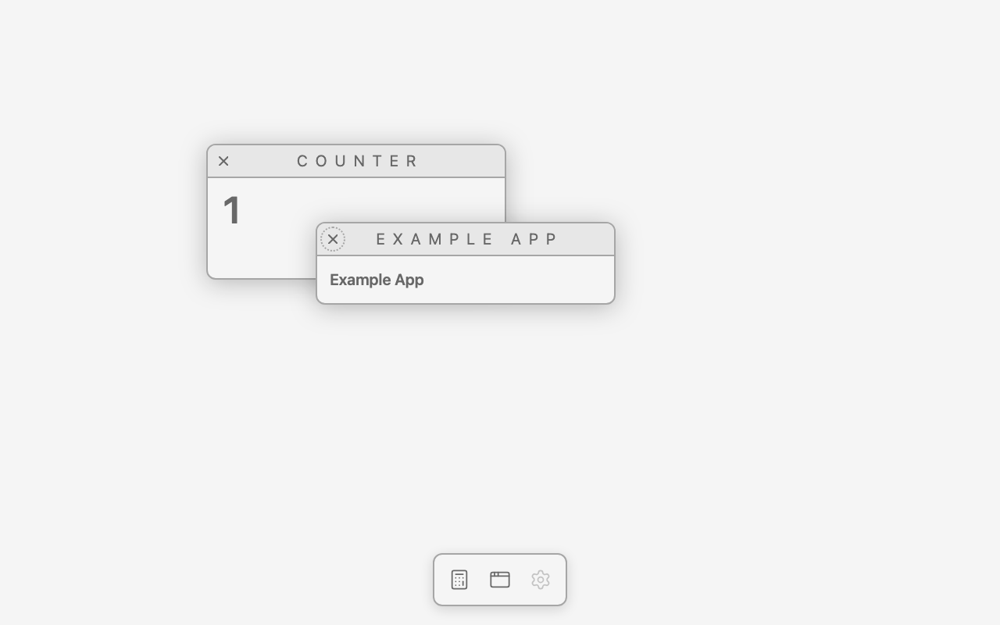
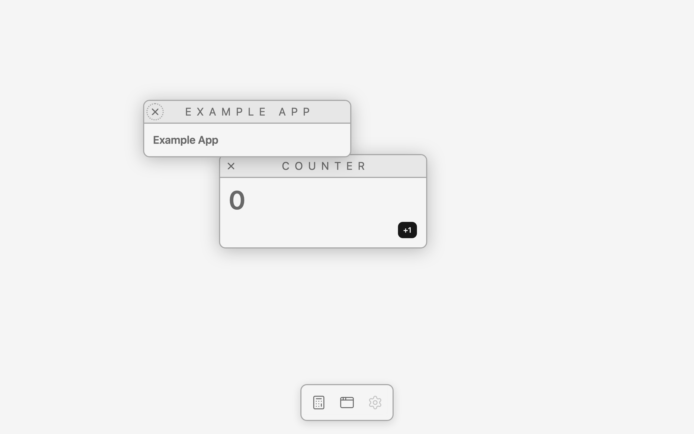

# An active window

Branch `feat/active-window`. Answers the finding the
[multiple-windows](./multiple-windows.md#found-on-screen-to-be-discussed) feature left open.

## Need

With two windows open, Tab walks the whole page: Counter's close, "+1", Example's close, then the
three dock icons, then out of the document — DOM order, a web page. Measured before any of this was
built, five Tabs from a dock click go `Settings icon → nothing → Counter close → "+1" → Example
close`, and the keyboard crosses from one window into another without anything happening to say so.

On a desktop, Tab never leaves the window you are in. It cycles that window's controls and wraps; a
separate shortcut switches windows; the dock is not in the Tab order at all. So this feature is the
first one where the desktop has to have an **active window** — and it is the first consumer of the
engine's draw order outside the render loop, which is the thing that list has been waiting for.

## Design

### Active is the front window. There is no second concept

The engine already keeps an ordered list of what it draws and already decides who is in front: a
press raises, the dock raises, and drawing goes back to front
([ADR 005](../decisions/005-draw-order-lives-in-the-engine.md)). "Active" is a name for the last
item in that list and nothing else.

So there is no "active window" state anywhere, nothing to keep in sync, and every existing way of
changing the front is already a way of changing the active window: pressing one, raising it from
its dock icon, opening one (it registers in front), closing the front one (the next takes over).
Pressing the empty desktop changes nothing, because the desktop is not in the list. This is the
open question [ADR 005](../decisions/005-draw-order-lives-in-the-engine.md) left —
"a desktop that wants focus and order to be different things" — answered *no*, and written down as
[ADR 007](../decisions/007-active-is-the-front-window.md).

### Tab is confined to the front item, by the engine handling the key

The platform's tool for this is `inert` on every window that isn't in front. It was tried on screen
first, because this desktop raises windows by being pointed at and inert elements cannot be pointed
at. It [does not work](../engineering-notes/2026-09-18-inert-and-keyboard-confinement.md): an inert
mount disappears from hit-testing entirely — `elementFromPoint` on the buried window's frame answers
`canvas` — so pressing a buried window raises nothing, and the *pointer* half of the desktop breaks
to fix the keyboard half. It also only does half the job: Tab still walks out of the front window
into the dock and never wraps. (It does not change the snapshot at all, which is worth knowing for
later; the canvas comes out byte-identical either way.)

So the engine listens for `keydown` and does it itself:

```ts
if (event.key !== "Tab") return;
const front = items.at(-1);
if (!front) return;          // nothing drawn: the page's own Tab order is right (the dock)
event.preventDefault();      // Tab never leaves the front item — the confinement *is* the edge
focusNextIn(front.element, event.shiftKey);
```

`focusNextIn` collects the front element's tabbable controls in DOM order and moves to the next one,
wrapping at both ends; Shift+Tab goes backwards. Focus that isn't in the front item — the dock, the
body, another window — counts as "before the first", so Tab from anywhere lands on the front
window's first control and Shift+Tab on its last. That is the whole rule, and it gives the dock's
Tab behaviour for free: with no window open the engine returns early and the page does what it
always did.

`preventDefault` is unconditional rather than only at the edges, because at every position the
browser's own next stop is wrong — the windows are siblings in the canvas and the dock is right
after them.

The listener goes on `canvas.ownerDocument`, not on the canvas: a key event is delivered to whatever
has focus, and while a window is open that may be the dock or the body, neither of which is inside
the canvas. That is a real claim on the host — while the engine has items, Tab in that document is
the engine's — and it is the claim a desktop wants (see [ADR 007](../decisions/007-active-is-the-front-window.md)).

### Focus follows the front window, and lands on the mount

When the front item changes, keyboard focus that is sitting **inside a window that is no longer the
front one** moves to the newly front window. Focus anywhere else is left exactly where it is, which
is the whole safety of the rule:

- Pressing a control in a buried window raises that window and the focus check passes over it (the
  focus was in the *other* window, so it moves to the raised one) — and then the browser's own
  mousedown focus puts the pressed control in focus, as it does on any page. The pressed control
  wins, which is what it should do.
- Clicking a dock icon to raise an app leaves focus on the dock icon: it was never in a window.

Focus lands on **the mount itself**, which the engine makes programmatically focusable with a
`tabindex="-1"` written once at registration, not on the window's first control. Two reasons. The
first tabbable control of every window in this desktop is its **close** button, and a window
switcher that arms the close button is a window switcher that closes windows. And "the window has
the keyboard, no control in it does" is a state the desktop needs anyway — it is exactly where Tab
starts from, so `Ctrl+\`` then Tab lands on the first control and reads the same as opening a window
and pressing Tab.

A focusable mount brings one thing with it the desktop has to answer: the UA focus ring frames the
whole mount, shadow band included, which would *be* an active-window marker. `Window` turns it off
(`outline-none`) — this desktop marks the active window in no way at all, on purpose.

Closing is the one case where the focus is inside the item that is going away, so `remove()` asks
before it splices and hands focus to the new front window after. Asking is not quite enough on its
own: React detaches a window's DOM *before* it runs the effect cleanup that unregisters the
drawable, so by then the close button that had the keyboard is already gone and the document has
nothing focused. An element that is no longer connected, with nothing focused, is how that case is
told apart from a removal that never had the keyboard — and it cannot steal focus either way,
because there is none to steal.

### A window-switching shortcut, and who owns it

**Ctrl+\` cycles forward, Ctrl+Shift+\` cycles backward.** The desktop shortcuts one would reach for
first are all taken before a page sees them: Cmd+\` and Cmd+Tab are macOS's, Alt+Tab is the OS's on
Windows and Linux, and Ctrl+Tab is the browser's tab switcher. Ctrl+\` is the closest free one and
keeps the `\`` that macOS uses for "next window of this app".

It is matched on `event.code === "Backquote"` with `ctrlKey`, never on `event.key`: `key` is
whatever the layout produces for that physical key, and on a lot of layouts that is not a backquote
at all. It is `preventDefault`ed.

**The key belongs to the desktop, the cycling belongs to the engine.** Which key switches windows is
OS policy, and the shell is the OS here; what "the next window" means is the draw order, which is
the engine's. So `apps/shell` keeps one `keydown` listener that calls
`engine.cycleFront("forward" | "backward")` and knows nothing else about it.

The cycle has to visit every window and come back to where it started, which a repeated `raise()` of
"the one behind the front" does not do — it swaps the top two forever. What does: **forward brings
the back-most item to the front; backward sends the front item to the back.** Those are exact
inverses, they are one rotation of the list, and N presses return the order to itself. It is a pure
function next to `moveToFront` in `order.ts`, with its own unit test.

### What the engine gained, and what it deliberately did not

Added to the engine: the keyboard rule for the scene (Tab confinement, focus follows the front) and
`cycleFront(direction)`. That is one new public method.

**Not added: a public read of the front item, and a "front changed" subscription.** The
multiple-windows note expected both. Neither has a consumer: the engine reads its own front
(`items.at(-1)`) to act on it, and nothing in `apps/shell` needs to know which window is active —
the one thing that would, a visual marker for the active window, does not exist and has not been
decided. Publishing "who is in front" with nobody reading it is a second copy of the truth, the
thing this project keeps refusing to build early. It is one line and a listener set on the day a
marker asks for it.

**The binding gained one prop**, the same shape as the one `<Drawable ref>` got last feature:

```ts
export type CanvasSurfaceProps = Omit<ComponentProps<"canvas">, "children" | "ref"> & {
  children?: ReactNode;
  ref?: Ref<Engine | null>;
};
```

`<CanvasSurface ref>` hands back the **engine, not the `<canvas>`**. The desktop needs it because
the shortcut listener lives in `App`, which is *outside* `<CanvasSurface>` and so cannot use
`useEngine()` — that context is provided to the canvas's children. It is one
`useImperativeHandle`, and the desktop calls exactly one method on what comes back.

**Files.** `packages/engine/src/focus.ts` (new: the tabbable set and moving focus within an
element), `packages/engine/src/order.ts` + `order.test.ts` (`cycleFront`), `packages/engine/src/index.ts`
(the `keydown` listener, focus-follows-front, `engine.cycleFront`, `tabindex` on a mount),
`packages/react/src/CanvasSurface.tsx` + `index.ts` (the engine ref), `apps/shell/src/App.tsx` (the
Ctrl+\` listener), `apps/shell/src/components/Window/Window.tsx` (no focus ring on the mount),
`scripts/screenshot.mjs` (`KEYS`, a focused-element report, focus emulation).

### Not here

- **No visual marker for the active window.** No dimmed inactive header, no focus ring on the front
  window, no title-bar difference — the front window is already the one you can see all of, and what
  (if anything) should mark it is an open decision, not something this feature invents.
- **No window switcher UI.** Ctrl+\` cycles; nothing draws a list of windows while it is held.
- No focus trap for anything but Tab: Escape, arrow keys and shortcuts inside an app are the app's.
- The dock is not reachable by Tab while a window is open. That is the desktop behaviour being
  copied (macOS needs Ctrl+F3 for its dock), and a keyboard route to the dock is its own decision.
- Minimize, a window list, and per-app window sizes are still not here.

## On screen

Chrome for Testing 153 (`--enable-blink-features=CanvasDrawElement`), 1280×800, `pnpm screenshot`.
Same geometry as the [last feature](./multiple-windows.md#on-screen): windows open at (228, 152) and
(368, 252), frames at (264, 184) and (404, 284), the Counter's "+1" drawn at (612, 324).

| Tab stays in the front window | Ctrl+\` brings the other one forward, keyboard with it | One press raises *and* keeps the pressed control | Closing hands the keyboard on |
|---|---|---|---|
|  |  |  |  |

| Nothing open: Tab is the dock's | Raised from the dock, keyboard untouched | Switched away from a window that had the keyboard | DPR 2 |
|---|---|---|---|
|  |  |  |  |

1. **The bug, measured first.** On `main`, with both windows open, five Tabs go `Settings icon →
   out of the document → Counter close → "+1" → Example close`, and Shift+Tab comes back to "+1".
   The keyboard crosses from one window into the other and out into the dock, in DOM order.
2. **Tab stays in the front window, and wraps.** Example then Counter open (Counter in front,
   `z-index: 1`); a press on the empty desktop at (100, 600) leaves nothing focused — **0 paint
   events**, and the order does not change, because the desktop is not in the scene. Then Tab →
   the Counter's **Close**, Tab → **"+1"**, Tab → **Close** again; Shift+Tab → +1 → Close → +1. Six
   keystrokes, always `drawable z1 Counter`: the Example window behind it and the three dock icons
   are never reached.
3. **Tab from the dock goes into the active window.** Opening both from the dock leaves focus on the
   Example dock icon, and the next Tab lands on the front window's Close — not on the Settings icon
   beside it.
4. **With no window open, Tab is the page's again.** Counter icon → Example App icon → Settings icon
   → out of the document, and **0 canvas paint events** for all of it: the dock is not drawn
   ([ADR 006](../decisions/006-the-dock-is-chrome-over-the-canvas.md)) and the engine returns early
   when it has no items.
5. **Ctrl+\` cycles, and comes back.** Each press costs **1 paint event** and swaps the order:
   `Counter z0 | Example z1` → `Example z0 | Counter z1` → back again → and again. Ctrl+Shift+\` is
   its exact inverse — forward then backward leaves the order it started in. With one window open it
   is a no-op (**0 paints**), with none it does nothing at all. There are only two openable apps, so
   "N presses visit every window and return to the start" is on screen for two and unit-tested for
   three.
6. **The keyboard follows the switch.** With focus on the Counter's "+1" (put there by a real
   click), Ctrl+\` brings the Example window forward **and moves focus to its mount** — out of a
   window that is no longer active — and the next Tab lands on Example's Close. 1 paint for the
   cycle, 1 for the Tab.
7. **A press that raises still focuses what was pressed.** The Example window dragged down out of
   the way (`DRAG="450,306:450,600"`: 27 `pointermove`, 25 `paint`, the same cost a drag has always
   had) so the buried Counter's "+1" is exposed, and the drag's own press left focus on the Example
   window's mount. One click on (612, 324): the Counter comes to the front (`z-index: 1`), the
   counter reads **1**, and focus ends on the **"+1" button** — not on the mount the engine focused
   a moment earlier in the same event. The engine hands the window the keyboard and the browser's
   mousedown focus takes it from there, which is what a press should do.
8. **Raising from the dock doesn't touch the keyboard.** A third click on the Counter's dock icon
   raises it (`z-index: 1`, **1 paint**) and focus stays on the **dock icon**: it was never inside a
   window, so nothing follows it.
9. **Closing the front window hands the keyboard to the next one.** Clicking the Example window's
   close control at (426, 306): **1 paint**, one mount left, and focus on **the Counter's mount**.
   Tab from there goes to the Counter's Close, then "+1".
10. **Idle is still 0 paint events per second** — before the interactions, and now measured for a
    second *after* them as well, with a control focused and its focus ring drawn. Nothing this
    feature writes happens in the paint pass: the `tabindex` is written once at registration and
    focus is a one-shot, so there is no attribute being toggled every time the order changes.
11. **DPR 2 is the same.** The same focus sequence, the same z-indices and the same paint counts on
    a 2560×1600 backing store.
12. **What a focus move costs, and why it isn't the engine.** Focusing the window's Close costs
    **1 paint event**; focusing "+1" costs **10–11**. Close is a plain button with an outline; "+1"
    is the shadcn Button with `transition-all`, and Chrome re-snapshots a drawable on every frame of
    a CSS transition running inside it. It is the same number a click on "+1" has cost since the
    counter feature, and it is worth knowing in general: **a 150 ms transition inside a drawable is
    ten snapshots**.
13. **`inert` was tried first and rejected on the evidence.** It leaves the snapshot byte-identical
    but takes the buried window out of hit-testing entirely, so pressing it raises nothing — and it
    doesn't confine Tab anyway. Measured in the
    [engineering note](../engineering-notes/2026-09-18-inert-and-keyboard-confinement.md).

Tooling: `pnpm screenshot` gained **`KEYS="Tab;Shift+Tab;Ctrl+Backquote"`** — keys pressed in order,
each one reporting what it focused, what it cost in paints and the draw order it left behind — a
focused-element line in the summary, `tabindex` on each mount, an **idle measurement after** the
actions as well as before, and `Emulation.setFocusEmulationEnabled`, without which a headless window
is never the OS's focused window and Tab moves nothing at all.
