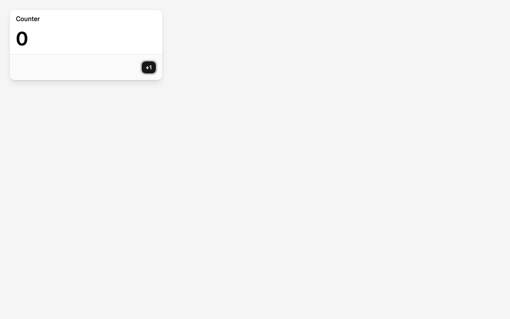
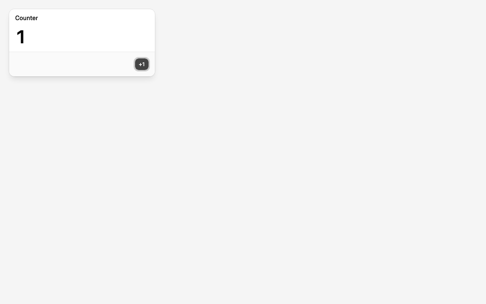
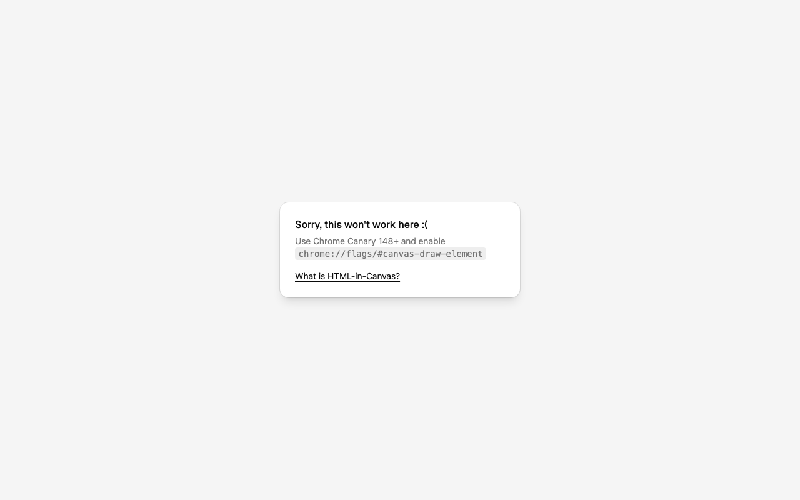

# 01 — A modal with a counter button, drawn through the canvas

Branch `feat/01-counter-modal`.

## Need

See one real HTML element drawn by the canvas through `drawElementImage`, and interact with it:
click "+1" and the number on the canvas changes. Text stays selectable and the button stays
keyboard-focusable — that's the whole point of HTML-in-Canvas over painting pixels.

It's first because it is the smallest proof that the API works in shipped Chrome, and because
the draw loop it produces is what every later feature (moving, dragging, windows) reuses.

## Design

Two facts about Base UI shape this: `Dialog.Portal` takes a `container`, and `Dialog.Root` takes
`modal={false}` (no focus trap, no scroll lock, no pointer blocking). So a real shadcn Dialog can
live *inside* the canvas as a drawable child — the Portal targets the canvas's mount instead of
`<body>`, where the canvas would have nothing to draw. (First draft assumed the Popup could render
with no Portal at all; Base UI 1.8 throws `<Dialog.Portal> is missing`, so it's a Portal with a
`container`.)

- **DOM shape.** `<canvas layoutsubtree content="drawable">` fills the viewport. Its only child is
  a `
` holding the modal, with padding so the modal's ring and shadow have room
  (see below for why). React renders both, as ordinary JSX children of the
  canvas. Canvas children are laid out but never painted by the page, so the only way the modal
  shows up is through the canvas.
- **The modal.** shadcn Dialog (Base UI) with `open`, `modal={false}`, a Portal whose
  `container` is the mount, no Backdrop. Title "Counter", the count, one Button "+1". No close
  button — there is nothing to close to yet; the window feature brings the chrome.
- **The draw.** One `draw()` in `CanvasSurface`: size the backing store to CSS size × device
  pixel ratio, clear, `drawElementImage(mount, 0, 0)`. It runs on the canvas `paint` event. The
  surface calls `requestPaint()` once after mount and on resize. Whether the counter also has to
  request a paint when its state changes, or the paint event fires by itself when the child
  re-renders, was found out on screen (see below): it fires by itself, so nothing else asks.
- **Setup landing with this feature.** Tailwind v4 via the Vite plugin, shadcn init with Base UI,
  `button` and `dialog`, the `@/` alias. The capability gate stays; its "supported" screen is
  replaced by the canvas.
- **Files.** `apps/shell/src/CounterModal.tsx` (dialog content), `apps/shell/src/CanvasSurface.tsx`
  (canvas, paint listener, draw), `App.tsx` mounts the surface. No packages.

## On screen

Chrome for Testing 153 (`--enable-blink-features=CanvasDrawElement`), 1280×800, via `pnpm screenshot`.

| Loaded | After `CLICK=button pnpm screenshot` |
|---|---|
|  |  |

- The probe reports `layoutsubtree: true`, `content: "drawable"`, and one drawable mount, 384×177,
  text `Counter0+1`. The page paints nothing else: the modal is only visible through the canvas.
- Clicking "+1" (a real CDP mouse press at the button's DOM rect) changes the DOM to `Counter1+1`
  and the canvas shows **1**. The button carries a focus ring because Base UI focuses the dialog on
  open — it's a real, focusable button.
- **The paint event fires by itself.** With the `requestPaint()`-on-count-change effect removed,
  the click still repainted the canvas to 1. Shipped Chrome fires `paint` whenever a drawable
  child's rendering changes; the surface only requests the first paint and on resize.
- **React drops `true` on attributes it doesn't know.** `<canvas layoutsubtree>` rendered nothing
  (`layoutsubtree: false` in the probe) and `drawElementImage` threw the predicted
  `requires the canvas to have the layoutsubtree attribute`. `layoutsubtree=""` / `drawable=""` fix it.
- **Base UI 1.8 requires the Portal.** `Dialog.Popup` without one throws `<Dialog.Portal> is missing`.
  `<Dialog.Portal container={mountRef}>` keeps the popup inside the canvas.
- **The snapshot includes ink outside the element's box.** With the popup at (0, 0) its 1px ring
  looked cut off on the top and left: that pixel sits at -1 and falls off the canvas. Padding on
  the mount (`p-6`) fixes it, and a `shadow-lg` added to check renders fully too — the snapshot is
  not clipped to the border box, only to the mount. Good news for window chrome later.
- **Fallback.** Along the way the unsupported-browser screen became a small card in the same
  style: 
