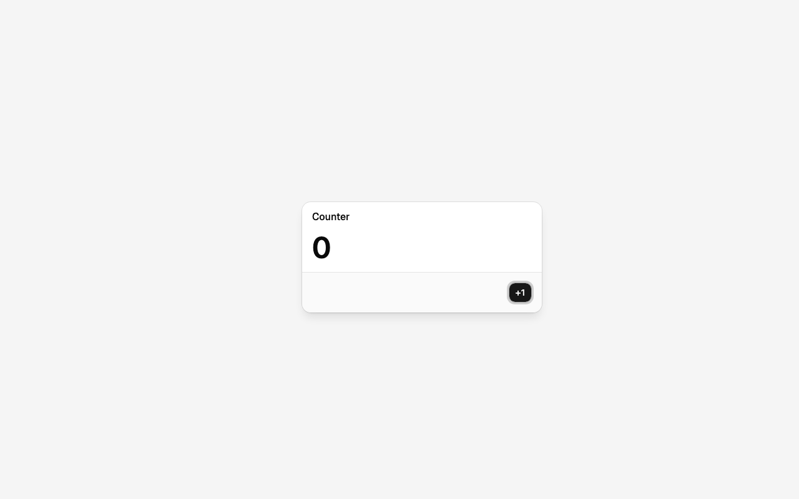
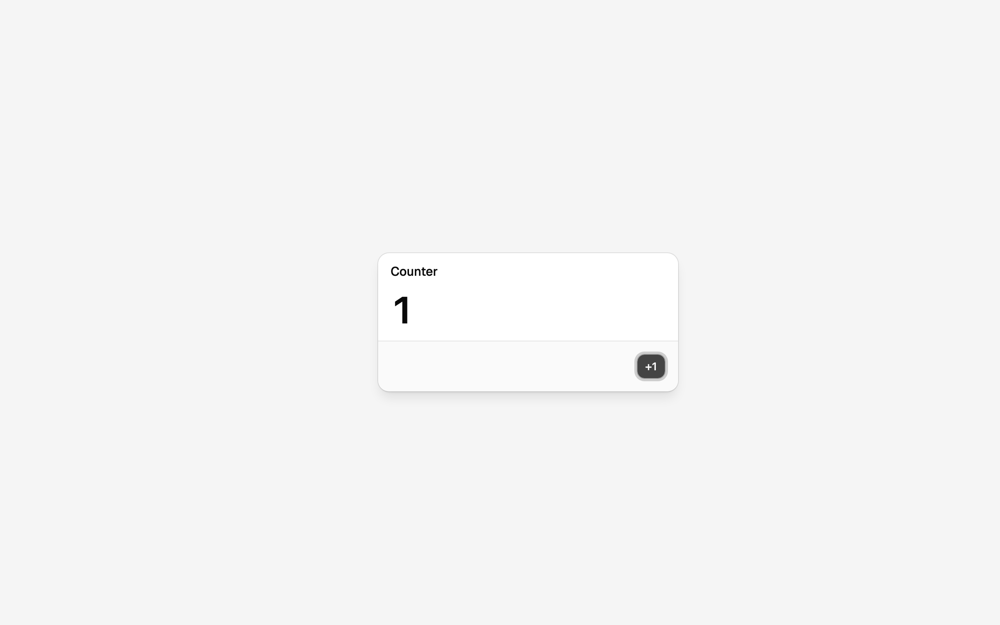

# Drag the modal by its header

Branch `feat/modal-drag`.

## Need

Grab the modal's header, move the mouse, and the modal follows — pixels *and* clicks. Releasing it
leaves it where it was dropped, and "+1" still increments from there. It's next because it is the
first time a position changes many times a second, which is what forces the answer to: **how is
repaint driven?** So far the canvas has repainted because Chrome noticed a drawable child
re-render ([counter modal](./counter-modal.md)). A drag changes no DOM in the content — only a
number the engine holds — so the engine has to ask for the repaint itself, at the right rate.

## Design

**Who picks the thing being dragged: the DOM does.** The drawable content is real DOM inside the
canvas and the engine already keeps its DOM rect on top of its drawn rect
([modal position](./modal-position.md)), so `pointerdown` lands on the header the user sees. No
picking, no hit-test structure, no scene graph — those earn their place when something is drawn
that is *not* a DOM element, or when two windows overlap.

- **The handle is registered with the engine, not handled in React.** The engine gets a new method
  on a drawable item:

  ```ts
  item.addDragHandle(handle: HTMLElement): () => void
  ```

  It attaches `pointerdown` to that element and owns the whole gesture: grab point, pointer
  capture, `touch-action: none`, the delta math, `moveTo`, and teardown. The returned function
  detaches. React's binding is one hook, next to `useDrawableMount()`:

  ```ts
  const handleRef = useDragHandle<HTMLDivElement>();   // <DialogHeader ref={handleRef}>
  ```

  The hook only hands the engine an element. No component sees a coordinate, and no position ever
  touches React state — during a whole drag React does not re-render at all.

- **The math.** `pointerdown` records the pointer's client point and the item's current position;
  each `pointermove` sets `start + (client − origin)`. Deltas are translation-invariant, so the
  canvas's own offset on the page does not enter the formula (a zoom/camera would, and that is
  where this gets revisited).

- **How repaint is driven — the thing this feature exists to answer.** Three candidates:

  1. `requestPaint()` on every `moveTo`. One request per `pointermove`, and a mouse can move more
     than once per frame, so a frame can carry several redundant requests.
  2. A frame loop: `requestAnimationFrame` coalescing, at most one `requestPaint()` per frame.
  3. **Dirty flag cleared by the paint event**: `moveTo` marks the engine dirty and calls
     `requestPaint()` only if no paint is outstanding; the `paint` handler clears the flag as it
     draws. The browser's own paint cycle *is* the frame loop, so the engine never runs a loop of
     its own and never queues work behind one.

  (3) is the design, because it keeps the rule the project already found — Chrome drives paint, the
  engine only says "something changed" — and needs no rAF. Its risk is real: if a `requestPaint()`
  ever fails to produce a `paint` event, the flag never clears and the drag freezes. That, the
  actual paint rate under a drag, and whether writing the CSS transform each paint feeds back into
  another paint (a free-running loop) are measured on screen below, and decide whether (2) comes
  back.

- **`position` becomes `initialPosition`.** `<Drawable position>` had an effect pushing prop
  changes into `moveTo`, which is a second owner of the position: after a drag the prop is stale,
  and any re-render with a different literal would snap the window back. The prop now seeds the
  item at registration and nothing else; the engine owns the position from then on.

- **Files.** `packages/engine/src/drag.ts` (gesture + math), `packages/engine/src/index.ts`
  (`addDragHandle`, dirty-flag scheduling), `packages/react/src/Drawable.tsx` (`useDragHandle`,
  `initialPosition`), `apps/shell/src/apps/CounterModal/CounterModal.tsx` (the header is the
  handle), `App.tsx`, `scripts/screenshot.mjs` (a `DRAG` option and paint-event counters).

Not here: window chrome, a close button, z-order, or anything with two windows in it. Bounds, too:
the modal may be dragged off the edge, and nothing clamps it yet.

## On screen

Chrome for Testing 153 (`--enable-blink-features=CanvasDrawElement`), 1280×800, `pnpm screenshot`.
The modal starts at (240, 160); its header's DOM rect is `280 200 352 16`, so the grab point is
(456, 208). Every run below drags it to (676, 348) — a delta of (+220, +140).

| Dropped at (460, 300) | Then "+1" clicked where it now draws | The same at DPR 2 |
|---|---|---|
|  |  |  |

1. **The pixels move and the hit-test geometry moves with them.** After the drag the probe reports
   the mount's DOM rect as `460 300 432 225` — exactly the start plus the pointer delta.
   `DRAG="456,208:676,348" CLICK_AT="833,469"` (the "+1" button where it is now *drawn*) turns the
   DOM into `Counter1+1` and the canvas shows **1**. At `DPR=2` the same run gives the same DOM
   rect and the same **1** on a 2560×1600 backing store: positions stay in CSS pixels and only the
   draw call multiplies by DPR, as the [position feature](./modal-position.md) established.
2. **No lag between the drawn rect and the DOM rect, by construction.** Sampled mid-gesture with
   the button still down, the mount reads `transform: matrix(1, 0, 0, 1, 460, 300)`, DOM rect
   `460 300 432 225`, and `elementFromPoint` at the pointer returns the dialog title — the header
   is still under the grab point. The transform is written from the matrix that *same* draw
   returned, so the two can never disagree; the only thing that could trail is both of them behind
   the pointer, and nothing visible did. No flicker: the snapshot is taken before transforms, so
   moving the element never affects what is drawn.
3. **Repaint driving, answered: the browser's paint cycle is the frame loop.** A 24-step drag with
   the moves paced 8 ms apart produced 25 `pointermove` and 25 `paint` events in ~710 ms — one
   paint per move, each `requestPaint()` answered before the next move arrived. Dispatching 60
   moves in a burst instead, Chrome delivered **3** `pointermove` events and the engine painted
   **2** times, and the modal still landed on the exact pixel: Chrome already coalesces pointer
   moves to roughly one per frame, so `requestPaint()` per move is naturally frame-bounded and the
   dirty flag catches whatever is left over. A `requestAnimationFrame` loop would add latency and
   buy nothing, so the engine still has no loop of its own. Every `requestPaint()` was followed by
   a `paint` event — the freeze the dirty flag risks never happened, at any pacing.
4. **Idle is idle: 0 paint events per second.** The engine only writes `element.style.transform`
   when the value actually changed. Without that guard, a style write on a drawable child is
   itself a reason for Chrome to fire `paint`, which is a free-running repaint loop; with it, a
   second of no input costs zero paints. (A single "+1" click costs 11 paint events — Chrome fires
   one per rendering change it notices: hover, press, focus ring, the new number. That is Chrome's
   own repaint policy, not the engine's.)
5. **Dragging twice works, and from wherever it was dropped.** `456,208 → 676,348` then
   `676,348 → 340,560` leaves the mount at `124 512 432 225`: the gesture tears itself down on
   release and the next press reads the item's current position, not the one React seeded.
6. **The surprise was React's, not the browser's.** The first build did nothing at all: the hook
   handed out a ref *object*, and Base UI mounts the portalled popup in a later commit than the
   one that registers the drawable, so by the time the header existed the hook's effect had
   already run with `ref.current === null` and never ran again. A callback ref (the element in
   state) attaches whenever the element appears, in either order. Told apart on screen by the
   handle's `style.touchAction` still being empty — the engine's own fingerprint on a handle it
   has taken.

Tooling: `pnpm screenshot` gained `DRAG="x1,y1:x2,y2"` (press, `DRAG_STEPS` interpolated moves
`DRAG_STEP_MS` apart, release — before any `CLICK`), and it now reports the canvas's `paint`
events, first over a second of idling and then over the drag, next to the pointer events the page
actually received.
