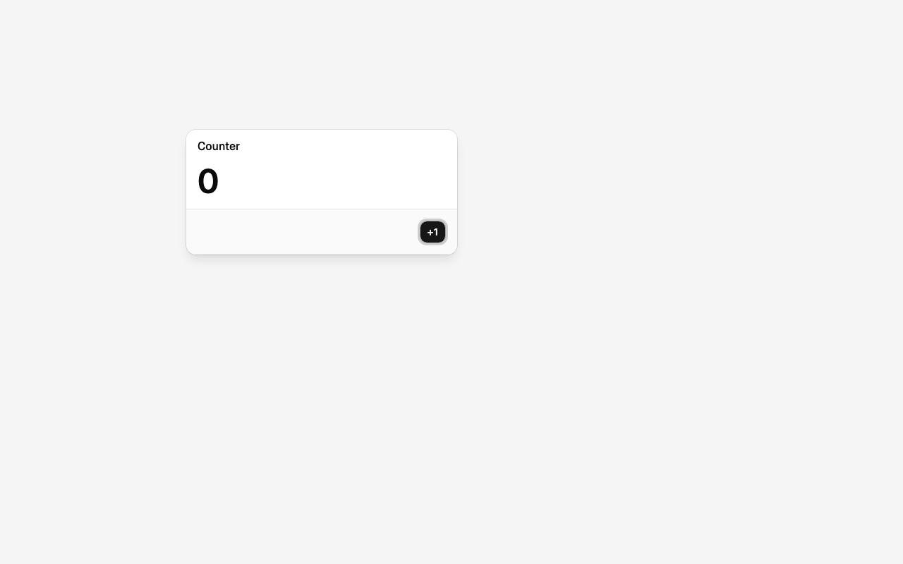
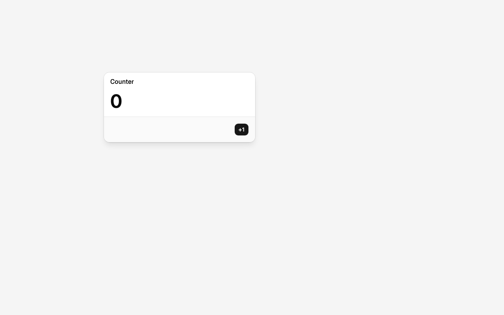
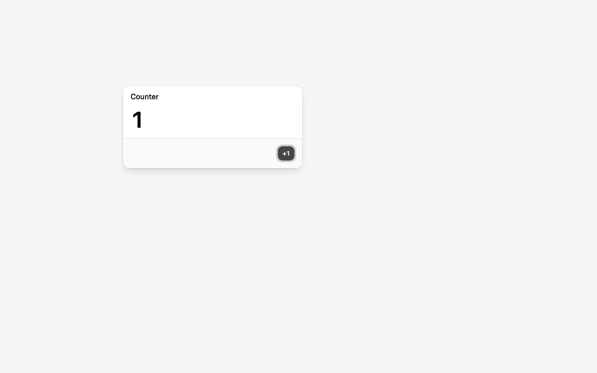

# Draw the modal somewhere other than (0, 0)

Branch `feat/engine-package-and-modal-position`.

## Need

The modal appears at a chosen point on the canvas, not glued to the corner. Every window later
needs this, and it's the first time the drawn position and the DOM position stop being the same
thing. Expected on screen: the pixels move, the click doesn't — Chrome hit-tests the mount where
layout put it (top-left), not where `drawElementImage` painted it.

## Design

- **Position is state the engine owns.** The desktop registers a DOM element with the engine at a
  position: `engine.add(element, { x, y })`. In React that's `<Drawable position={{ x, y }}>`.
  The draw call reads it; nothing in React holds it.
- **Then find out who owns the DOM position, on screen, in this order:**
  1. See the miss: click where the button is *drawn* (`CLICK_AT=x,y`) and watch the count stay 0.
     The probe prints each mount's `getBoundingClientRect()` next to the drawn position.
  2. Try what the API itself offers in this Chrome build: `drawElementImage` returns a DOMMatrix,
     and the explainer describes the browser syncing hit-test geometry from it. Check whether any
     geometry method exists on the context.
  3. If Chrome still ignores it, the engine writes the returned matrix to the element's CSS
     transform — the idiom from Chrome's own origin-trial post. Either way the rule is: **the
     engine owns both the drawn rect and the DOM rect; content never positions itself.**
- **The engine becomes a library** while doing this ([ADR 003](../decisions/003-engine-is-a-library-plugged-into-react.md)):
  `packages/engine` (`createEngine`, `add`, `moveTo`, `dispose`, no React) and a thin binding
  package `packages/react` (`CanvasSurface`, `Drawable`, `useDrawableMount`). React apps live in
  `apps/shell/src/apps/<Name>/` and import the hook from `@os-canvas/react`.
- **Files.** `packages/engine/src/index.ts`, `packages/react/src/*`, `apps/shell/src/apps/CounterModal/`, `App.tsx`,
  `scripts/screenshot.mjs` (`CLICK_AT`, `DPR`, DOM rect in the probe).

Not here: position that changes over time. That's dragging, where the repaint-per-frame question
lives.

## On screen

Chrome for Testing 153 (`--enable-blink-features=CanvasDrawElement`), 1280×800, `pnpm screenshot`.
Position `{ x: 240, y: 160 }`; the button's drawn center is (613, 329).

| Drawn at (240, 160) | Click where drawn, DOM rect still at (0, 0) | Click where drawn, engine syncing geometry |
|---|---|---|
|  |  |  |

1. **The miss, as predicted.** With only `drawElementImage(mount, 240, 160)`, the probe reports the
   mount's `getBoundingClientRect()` as `0 0 432 225` while the pixels are at (240, 160).
   `CLICK_AT=613,329` — the drawn button — leaves the DOM at `Counter0+1`. `elementFromPoint` at
   the old corner still returns the modal; at the drawn position it returns the canvas.
2. **The API offers nothing else in this build.** The only element-related method on
   `CanvasRenderingContext2D` is `drawElementImage`. It returns a `DOMMatrix` carrying the draw
   position and the DOM rect stays at `0 0` afterwards. No `updateElementGeometry` yet. (Two days
   before this note, WICG/html-in-canvas#174 announced 2D contexts will sync automatically and the
   return value goes away; this build predates it.)
3. **The fix, the documented way.** The engine writes the returned matrix to the element:
   `element.style.transform = transform.toString()`. Pixels unchanged (the snapshot is recorded
   before transforms); the probe reports `240 160 432 225`; the same click changes the DOM to
   `Counter1+1` and the canvas shows **1**. When the browser starts returning `undefined`, that
   line is a no-op.
4. **Device pixel ratio, found the hard way.** At `DPR=2` the first version drew the modal four
   times its device size and the matrix came back as `matrix(2, 0, 0, 2, 456, 272.5)`: the mount's
   DOM rect became `240 160 864 450` and the click missed. `drawElementImage` already records its
   snapshot at device resolution and takes backing-store coordinates, so scaling the context by
   DPR doubles both the pixels and the returned matrix. With an identity context and
   `drawElementImage(el, x * dpr, y * dpr)`, DPR 2 gives `matrix(1, 0, 0, 1, 240, 160)`, the DOM
   rect `240 160 432 225`, and the click lands: 

Rule from here on: **the engine owns both the drawn rect and the DOM rect.** Content never
positions itself.

Tooling: `pnpm screenshot` gained `CLICK_AT=x,y` (click at page coordinates) and `DPR=n`, and the
probe prints each mount's DOM rect plus the element-related methods the context exposes.
