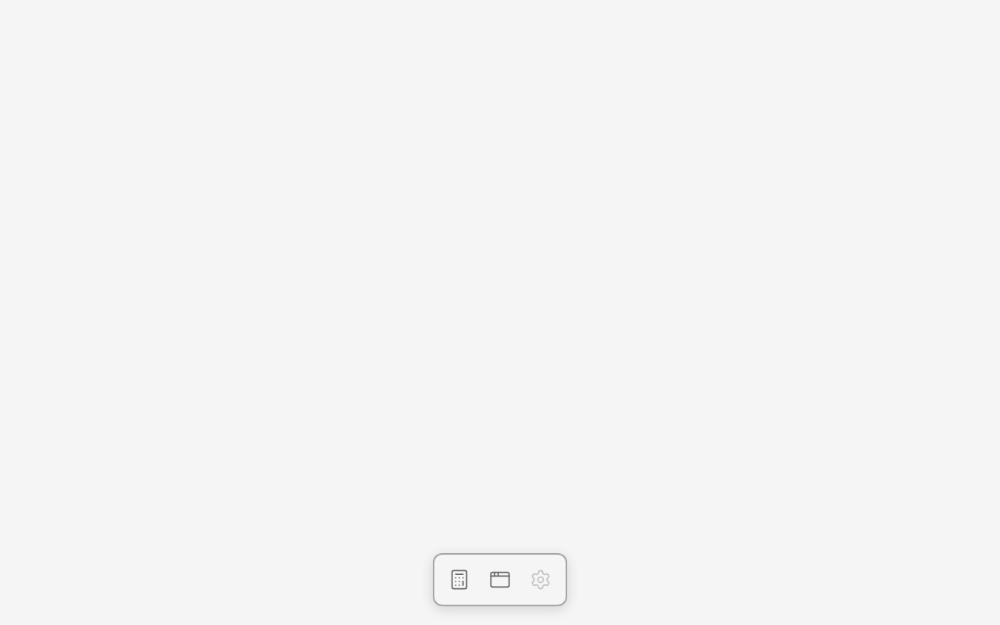
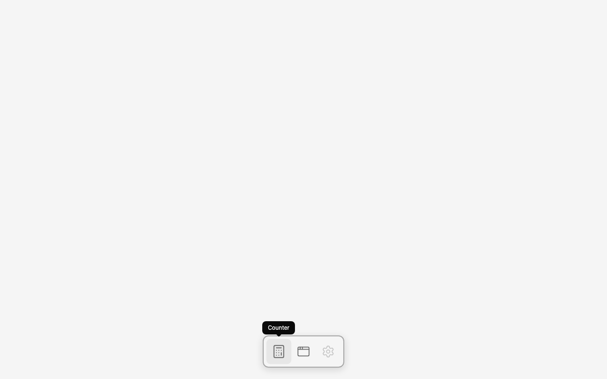
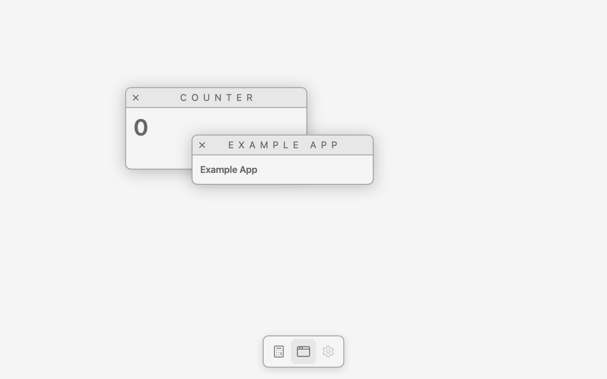
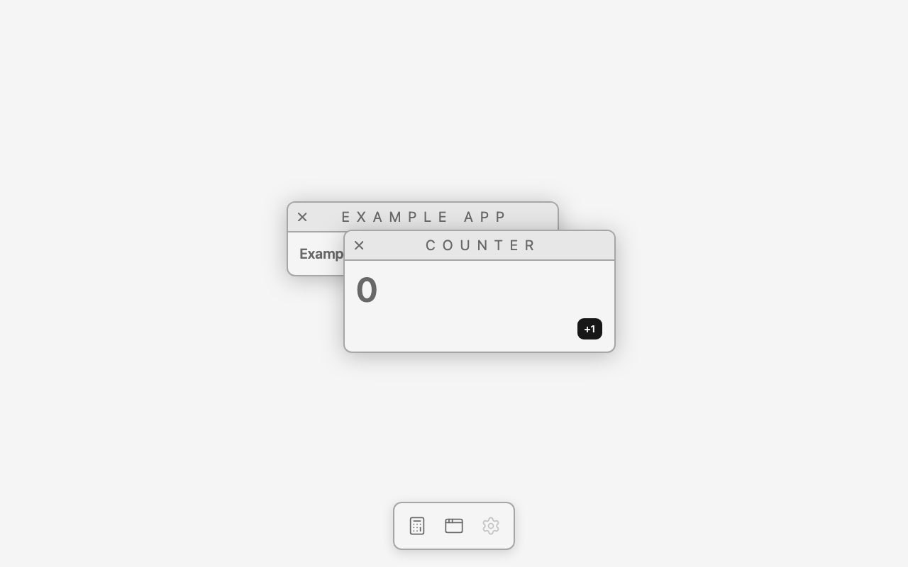
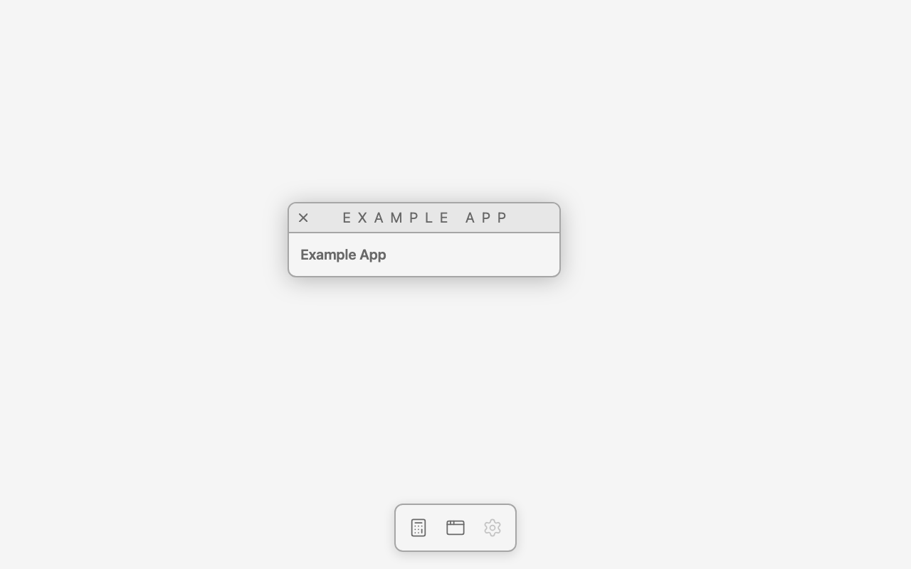
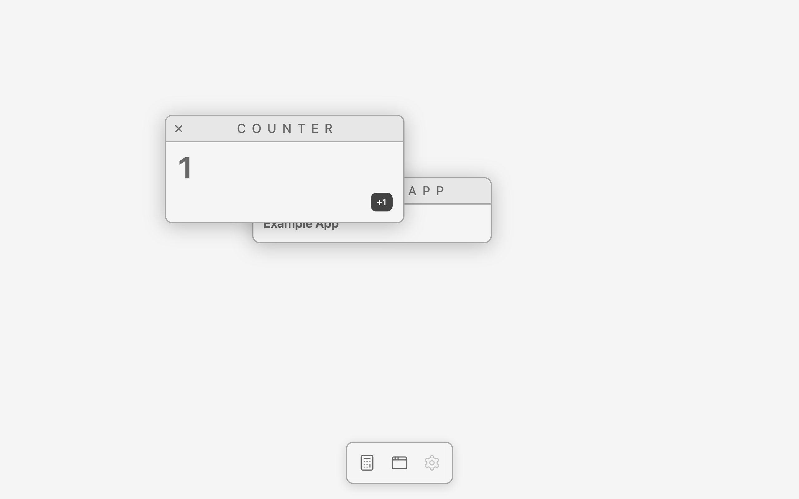

# Multiple windows, opened from a dock

Branch `feat/multiple-windows`. Merges what the roadmap listed as two features — a second window
(overlap, click-to-raise, z-order) and opening apps from a dock — because a PR about "a second
window" is a PR about a window the desktop hard-codes. The dock is what makes a window *opened*,
and it is the thing that asks all the interesting questions.

## Need

Several windows on the desktop at once, opened from a dock. Clicking a dock icon opens that app;
clicking it again brings its window forward instead of opening a second copy. The windows overlap;
pressing one brings it to the front — its pixels *and* its clicks; each drags by its header and
closes by its close button, and the ones still open keep their state.

It's next because it is the first time the engine holds more than one thing *and* the first time
the desktop doesn't know in advance what it is holding. The moment two things overlap, "which one
is in front" stops being an accident of insertion order and becomes state someone owns; the moment
a dock opens them, "which windows exist" becomes state too — and the two are not owned by the same
side.

## Design

### The dock

Ported from the reference desktop's [`DockBar`](https://github.com/0xFrann/desktop-os-react-next/blob/main/src/components/index/DockBar.tsx):
a bar of app icons, a label on hover, click to open, and a disabled state for an app that isn't
available. What is *not* ported is its look.

**Project rule, decided here: the reference desktop is the source of truth for what exists and how
it behaves, not for how it looks.** Which apps the dock has, what they are called, that Settings can
be shown-but-unavailable, that Example Two is a desktop icon and not a dock app — all of that comes
from the reference and nothing in this repo invents around it. The visual design is this project's
own, built from what the shell already uses: Tailwind, shadcn/Base UI, lucide. (An earlier pass of
this feature ported the reference's SCSS and its SVG icons; that is the part that was thrown away.)

So the dock is a bottom-centre bar in the window chrome's own greys — `--window` at 85% over a
blur, the same 2px `--window-border` and `--window-radius` — so the dock and the windows read as one
desktop. Hover is a subtle scale plus a `--window-header` wash; the label is a
[shadcn Tooltip](../../apps/shell/src/components/ui/tooltip.tsx) (Base UI), added the way
`button.tsx` was, and portalled into the desktop element instead of `<body>` — the dialog's fix
(ADR 002) applied to chrome: the dock can't host it itself, since its transform and backdrop blur
make a containing block, so `Dock` takes a `tooltipContainer` and the desktop hands it its root. Icons are lucide, one obvious one per app: **`Calculator`** for Counter,
**`AppWindow`** for Example App, **`Settings`** for Settings.

Two content decisions, both explicit:

- **Settings is in the dock and disabled.** It is a dock app in the reference, but its content there
  is the background chooser, and this desktop has no wallpaper yet. Rather than invent something for
  it to show, it uses the reference's own `disabled` flag: dimmed, not clickable, and it opens
  nothing. It becomes live with the wallpaper feature.
- **Example Two is not in the dock.** In the reference it is a desktop icon, and the desktop icon
  grid is its own roadmap row.

### Many windows at once

**Decided here: several windows open at the same time, where the reference shows one.** The
reference swaps a single `app` in a context and renders one `AppsWindow`; this desktop keeps a list.
It costs nothing — the engine already draws an ordered list and raises the pressed item
([ADR 005](../decisions/005-draw-order-lives-in-the-engine.md)) — and showing one at a time would
mean *throwing away* the overlap, the z-order and the raise that the engine already does. It is also
the thing a canvas desktop is for: the interesting questions (overlap, stacking, hit-testing,
repaint cost with N things) only exist when N > 1.

### Who owns what

The line, and this feature is where it gets drawn precisely:

- **Which windows exist is React state, in the desktop.** `App.tsx` keeps a list of open windows and
  renders a `<Window>` per entry. It has to be React's: mounting a `<Window>` is what registers a
  drawable, and unmounting it is what unregisters one. Opening and closing are React re-renders.
- **Where they are and what order they are in is the engine's.** Nothing in `apps/shell` reads or
  writes a position or a z-index. Dragging a window and raising one re-render nothing.

Which leaves one gap: to raise a window that is *already open* when its dock icon is clicked, the
desktop needs that window's engine item. There is no pointer on the window, so the engine's
press-to-raise can't do it; `item.raise()` exists for exactly this case and has since ADR 005, but
the desktop had no way to get an `item`.

**The binding for it — the whole change to `packages/react`:**

```ts
export type DrawableProps = Omit<ComponentProps<"div">, "children" | "ref"> & {
  children?: ReactNode;
  initialPosition: Position;
  ref?: Ref<DrawableItem | null>;
};
```

`<Drawable ref>` hands back the **engine item, not the `<div>`** (the element stays
`useDrawableMount()`), the way a canvas library hands back its own node rather than a DOM one.
`Window` forwards the same prop, so the desktop writes `<Window ref={…}>` and keeps a
`Map<appId, DrawableItem>` in a ref. Inside, it is `useImperativeHandle(ref, () => item, [item])` —
three lines.

It does not leak ownership: the item's methods stay the engine's, the desktop calls exactly one of
them (`raise()`), and nothing reads `item.position` into state. `packages/engine` is **unchanged**
by this feature.

**Opening is idempotent, and so is raising.** One dock handler does both:

```tsx
const openApp = (id: string) => {
  setOpenWindows((windows) => (windows.some((w) => w.id === id) ? windows : [...windows, …]));
  items.get(id)?.raise();
};
```

Already open → the list doesn't change (no re-render) and the item is raised. Not open → the list
grows, and the engine registers the new window in front anyway.

**Where a new window opens.** The desktop cascades: a fixed first position and a fixed step, and a
window takes the lowest step no open window is using. That last part matters on screen — with a
plain "offset by how many are open", closing one app and reopening it drops the new window exactly
on top of another one. This is the only placement policy the desktop has; the engine owns the
position from registration onwards.

**Closing.** `Window` has had an `onClose` prop since the [window feature](./window-drag.md) with
nothing wired to it, because there was nowhere to reopen an app from. The dock is that place, so the
desktop now passes it and the close button removes the window from the list. React unmounts it, the
`<Drawable>` effect's cleanup calls `item.remove()`, and the engine drops it from the order.

### The dock is not drawn

The dock is desktop chrome, so it is plain DOM laid over the canvas, not a drawable
([ADR 006](../decisions/006-the-dock-is-chrome-over-the-canvas.md)). The canvas draws the scene —
things with a position the user can change, an order, and a lifetime the user controls. The dock has
none of those, and registering it would mean asking the engine for "pinned" and "never raise"
exceptions on the first day it has two kinds of drawable.

`packages/react` needed no change to allow it: `CanvasSurface` renders a single `<canvas>` element,
so the desktop wraps it in a positioned `div` and renders `<Dock>` as its sibling.

### Still just a list

The roadmap used to say this feature is where a document object earns its place. It isn't. What two
overlapping windows need is an **ordered list of drawn items inside the engine**, which is what
`packages/engine/src/order.ts` is and all it is — no tree, no ids, no scene graph. A named document
waits for a consumer *outside* the render loop: a menu bar that shows the active app, minimize, a
camera. Opening windows from a dock did not become one, because the list of open windows is React's
and the list of drawn items is the engine's, and neither needs to be handed to a third thing.

**Files.** `apps/shell/src/apps/dockApps.tsx` (which apps the dock has), `apps/shell/src/components/Dock/`,
`apps/shell/src/components/ui/tooltip.tsx` (shadcn), `apps/shell/src/App.tsx` (open/close/raise, the
cascade), `apps/shell/src/components/Window/Window.tsx` (forwards the item ref),
`apps/shell/src/index.css` (`.desktop`), `packages/react/src/Drawable.tsx` + `index.ts` (the item
ref), `scripts/screenshot.mjs` (several selector clicks in order, `HOVER`, and a fixed action order).
`packages/engine` is untouched.

Not here: per-app window sizes (`APP_WINDOWS_SIZE` in the reference), minimize, focus or any "active
window" marker, bounds, a window list / taskbar, the URL hash the reference syncs its open app to,
Settings' content. Nothing clamps a window to the desktop, and nothing stops a window being dragged
under the dock.

### Found on screen, to be discussed

**Tab walks the whole desktop.** With two windows open, Tab goes Counter close → "+1" → Example
close → the dock icons, in DOM order: a web page, not a desktop. On a desktop Tab never leaves the
active window; it cycles that window's controls and wraps, a separate shortcut switches windows
(Cmd+` on macOS, Alt+Tab on Windows), and the dock is not in the Tab order at all.

Proposed model, not built: the active window is the front one (the engine's draw order already
says which), Tab is confined to it, Tab with nothing focused goes to the front window's first
control, and with no window open it goes to the dock. That is the first thing outside the render
loop that needs to know who is in front, so the engine would gain a read of the front item and a
"front changed" notification — the consumer the ordered list was waiting for. Alternative on the
table: Tab picks a window first, then navigates inside it (a two-level order, like a tree widget).
Its own roadmap row; decided there.

## On screen

Chrome for Testing 153 (`--enable-blink-features=CanvasDrawElement`), 1280×800, `pnpm screenshot`.
Windows open at (228, 152) and (368, 252) — a position is the mount's, and the mount is the frame
plus the band its drop shadow is drawn into (36 left, 32 top), so the frames are at (264, 184) and
(404, 284). They overlap over `404…648 × 284…358`, and the Counter's "+1" button, drawn at
(612, 324), sits inside that overlap: buried at startup, which makes it the probe for most of what
follows.

| The dock, nothing open | Hover: zoom and label | Both open, overlapping | Counter raised, then "+1" |
|---|---|---|---|
|  |  |  |  |

| Raised from its dock icon (no pointer on it) | Dragged out from behind | Closed by its close button |
|---|---|---|
|  |  |  |

1. **The dock is there and the desktop is empty.** `[drawable]` mounts: **none** — the dock is not
   in the scene. `elementFromPoint` on a dock icon answers the icon's `svg`, a plain page element,
   not a drawable.
2. **Hovering an icon costs the canvas nothing.** The icon scales, its label appears, and the canvas
   reports **0 paint events** — with no windows open and with both open. Chrome that isn't drawn
   isn't a drawable child, so nothing asks for a snapshot. Settings is dimmed in the same shot.
3. **Clicking two dock icons opens two windows, overlapping.** Mounts `228 152 456 246` (`z-index: 0`,
   Counter) and `368 252 456 178` (`z-index: 1`, Example App), each at its cascade slot. **2 paint
   events** per open. `HIT_AT` says the overlap belongs to the newer one: (612, 324) → Example,
   while (390, 300) — the Counter's frame, 14px outside Example's — → Counter.
4. **Clicking the disabled Settings icon does nothing at all.** **0 paint events**, mounts still
   empty. The window never exists, so there is nothing to close.
5. **Pressing the back window raises it.** `CLICK_AT="390,300"` → **1 paint event**, and the
   z-indices swap: Counter `1`, Example `0`. (612, 324) now answers the Counter. Nothing re-mounts,
   nothing moves, and the Example window keeps its place and its content.
6. **Its dock icon raises it too, with no pointer on the window.** Clicking Counter's icon a second
   time — the pointer is on the dock, 400px below either window — gives the same **1 paint event**
   and the same z-indices, Counter `1` / Example `0`, and (612, 324) answers the Counter. That is
   `item.raise()` reached through the new ref, and it is the only thing the desktop calls on an item.
7. **And the clicks follow the pixels.** `CLICK_AT="390,300;612,324"` raises the Counter (1 paint)
   and then presses the "+1" that was buried a moment ago (11 paints — Chrome's own hover/press/
   focus/number repaints): the DOM reads `Counter1+1` and the canvas shows **1**. Without the raise,
   the same click at the same point is answered by the Example window and the counter stays at 0.
8. **A buried window drags out from under the one in front, raising as it goes.**
   `DRAG="450,206:670,346"` on the Counter's header lands the mount at `448 292 456 246` — the start
   plus the pointer delta, exactly — with `z-index: 1` and the Example window untouched at
   `368 252`. Cost: **25 `pointermove`, 25 `paint` events** for a 24-step drag paced 8 ms apart,
   which is what one window cost. Clicking the "+1" where it now draws (832, 464) reaches the
   Counter.
9. **The close button closes, and only that window.** `CLICK_AT="286,206"` on the Counter's close
   control → **1 paint event**, one mount left (Example, `368 252`, `z-index: 0`), and (390, 300)
   — where the Counter was — now answers `canvas`. The dock is still there, and Example still works.
10. **Reopening from the dock gives the window back, in front and in its own slot.** Open both,
    close the Counter, click its dock icon again: the Counter returns at `228 152` with `z-index: 1`
    while Example stays at `368 252`, `z-index: 0`. That is the freed cascade slot being reused —
    with the naive "offset by how many are open" the Counter reopened at `368 252`, exactly on top
    of the Example window, which is what sent the cascade back to "lowest free step".
11. **Idle is still 0 paint events per second**, in every run above, with a dock on screen and up to
    two windows open.
12. **DPR 2 is the same.** `DPR=2` on run 7 gives the same mount rects in CSS pixels, the same
    z-indices and the same **1** on a 2560×1600 backing store:
    
13. **The shadows are complete, and identical at both DPRs.** Sampling the canvas straight down from
    a frame's bottom edge, the drop shadow reads 36, 33, 28, 22, 14, 6, 1, 0 out of 255 at 1, 3, 6,
    10, 16, 24, 34 and 44 CSS pixels below it — the same ramp at DPR 1 and DPR 2. It fades into the
    desktop instead of stopping in a step, which is what the band around the frame is for (below).
14. **Titles are one line.** "EXAMPLE APP" in a 384px window, no wrapping, no trimming.

Carried over from the first pass of this feature, both found on screen and both still standing:

15. **A window's shadow doesn't take the click.** The mount is the frame plus the band its drop
    shadow is drawn into, and that transparent band is part of what the browser hit-tests. Pressing
    the Counter at (390, 300) — on its frame, but inside the Example window's band — used to reach
    the Example mount and raise nothing (**0 paint events**), so a window could not be raised from
    anywhere near the one in front. The desktop's `Window` makes the mount `pointer-events: none`
    and the frame `pointer-events: auto`: the same press reaches the Counter (**1 paint**), the band
    over empty desktop answers `canvas`, and the engine's raise listener still fires, since the
    press bubbles from the frame to the mount. Runs 3, 5, 6, 7 and 12 use that point on purpose. The
    engine did not change: what is transparent in a snapshot is the desktop's knowledge, not the
    engine's.
16. **The shadow band is the shadow's measured size.** `drawElementImage` clips each snapshot to the
    drawn element's border box, so a 24px band ended the shadow in a step instead of a fade. Read
    against an 80px band, the reference's `0 4px 16px` shadow really reaches 35px sideways, 30px up
    and 38px down — 2.25× the blur radius, not the 3σ = 24px a Gaussian rule of thumb gives. The
    band is 36px sideways and that same 36 shifted by the shadow's 4px y-offset: **32 top, 36 sides,
    40 bottom**, which is why a window's position is 36/32 left and up of its frame. Measured in the
    [engineering note](../engineering-notes/2026-09-18-overlap-hit-order.md).
17. **The title is one line, always.** "Example App" wrapped to two lines at first, because the
    ported title style is `0.5em` letter-spacing and this window is 384px wide while the reference's
    is `60vw`. The header trims instead of wrapping (`min-w-0 overflow-hidden whitespace-nowrap
    text-ellipsis` on the `flex-1` span, `min-w-0` being what lets a flex item shrink below its own
    text) with a `title` attribute so a trimmed name stays one hover away. At this width the span
    gets 236px and "EXAMPLE APP" measures 239.36px, so it first drew as "EXAMPLE AP…" — short by the
    0.5em of letter-spacing CSS puts *after* the last letter, a gap nothing is drawn in. The span
    carries `-mr-[0.5em]`, which hands that gap back. Per-app window widths are the reference's
    `APP_WINDOWS_SIZE`, which this feature deliberately did not take on.

Tooling: `pnpm screenshot` gained `HOVER="selector"` (leave the pointer on something and report what
that cost), `CLICK` taking several selectors in order — each resolved right before it is clicked, so
a click can create what the next one matches — and a fixed action order, **CLICK (selectors), then
DRAG, then CLICK_AT (points)**: selectors act on the page's chrome, which is what opens a window,
and points act on what is drawn, which is what that window is.
