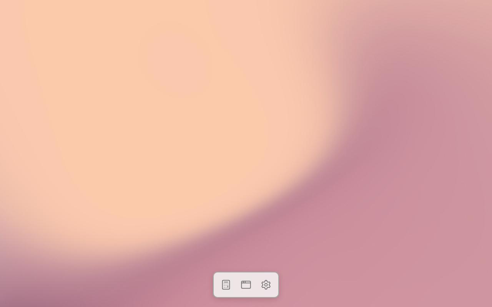
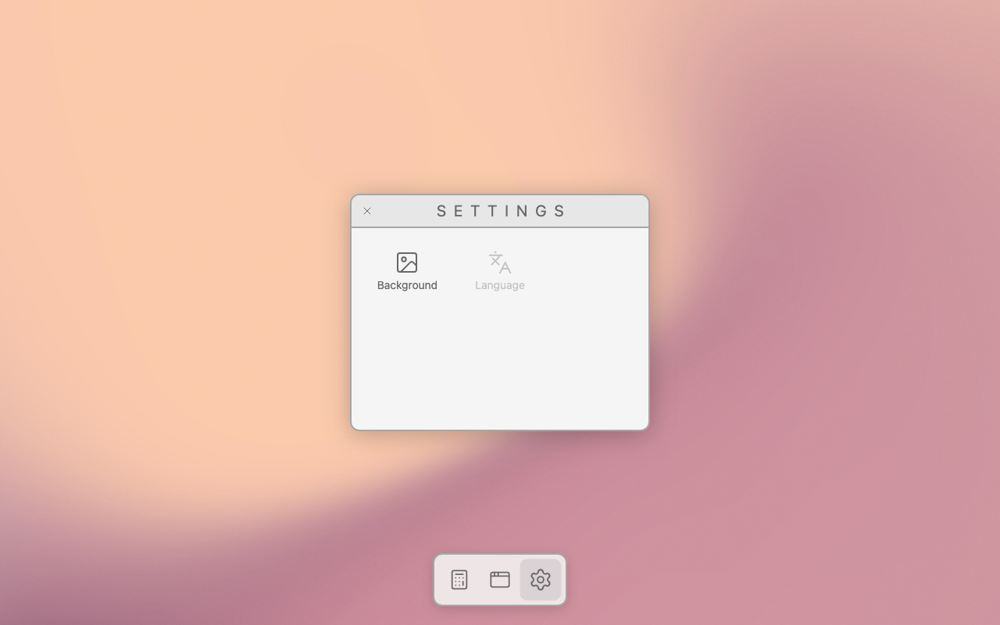
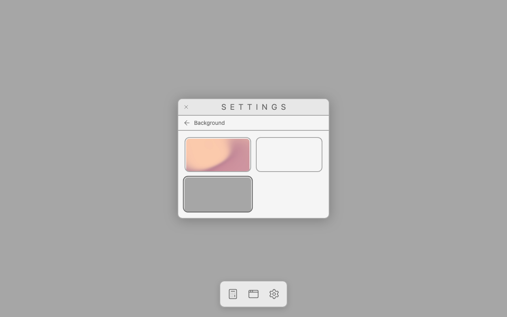
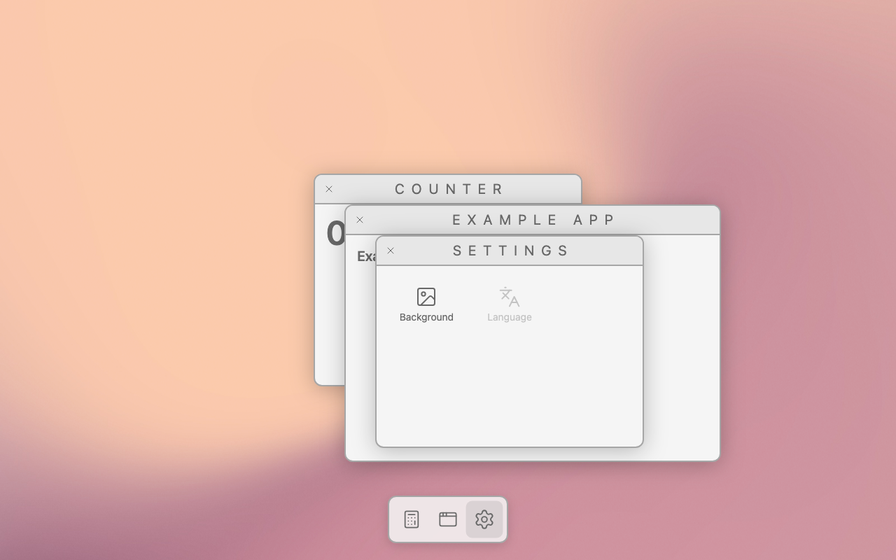
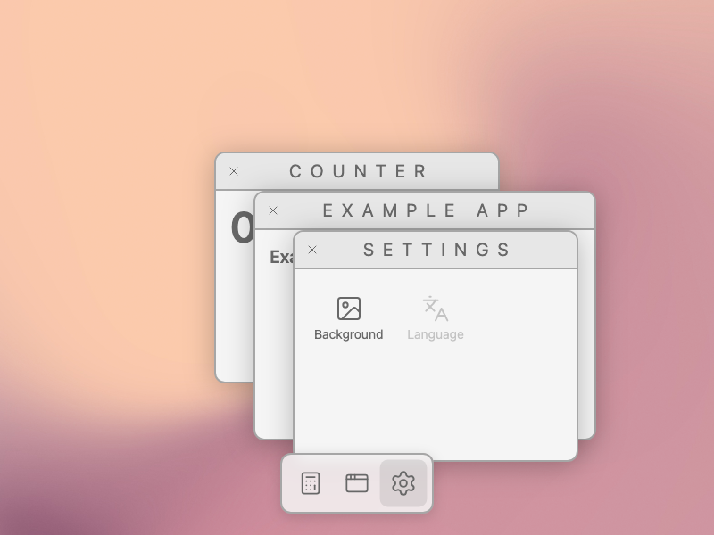
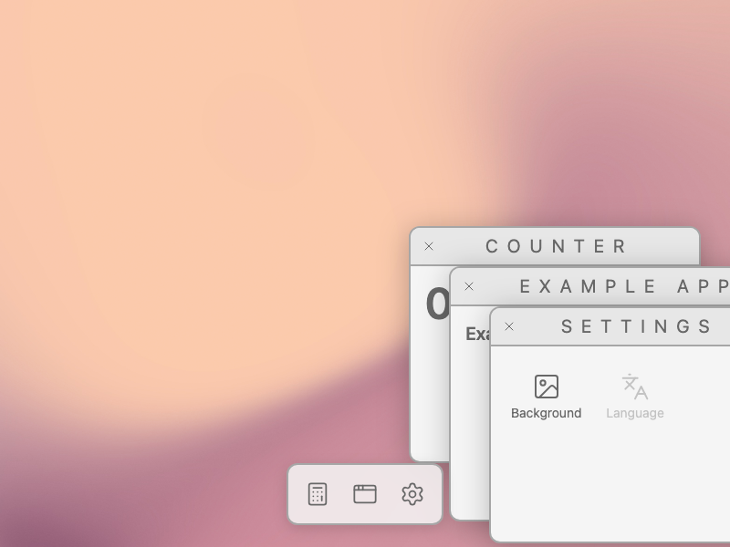
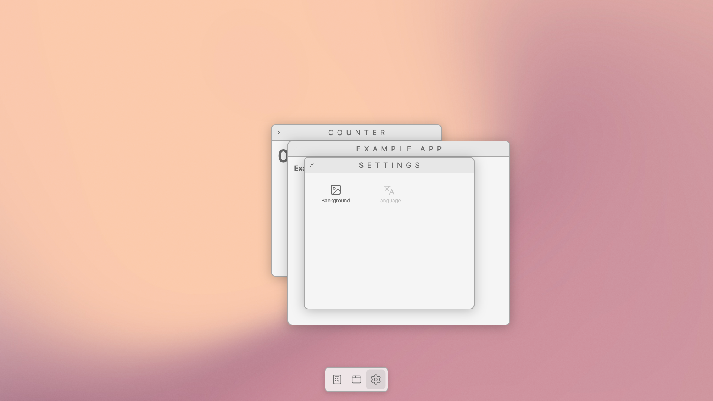
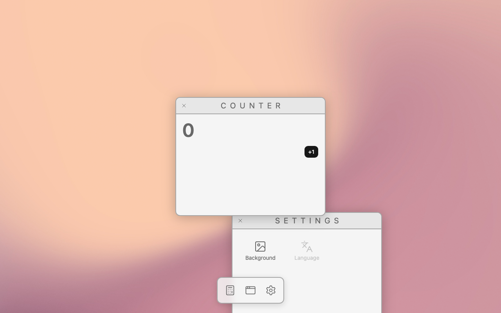
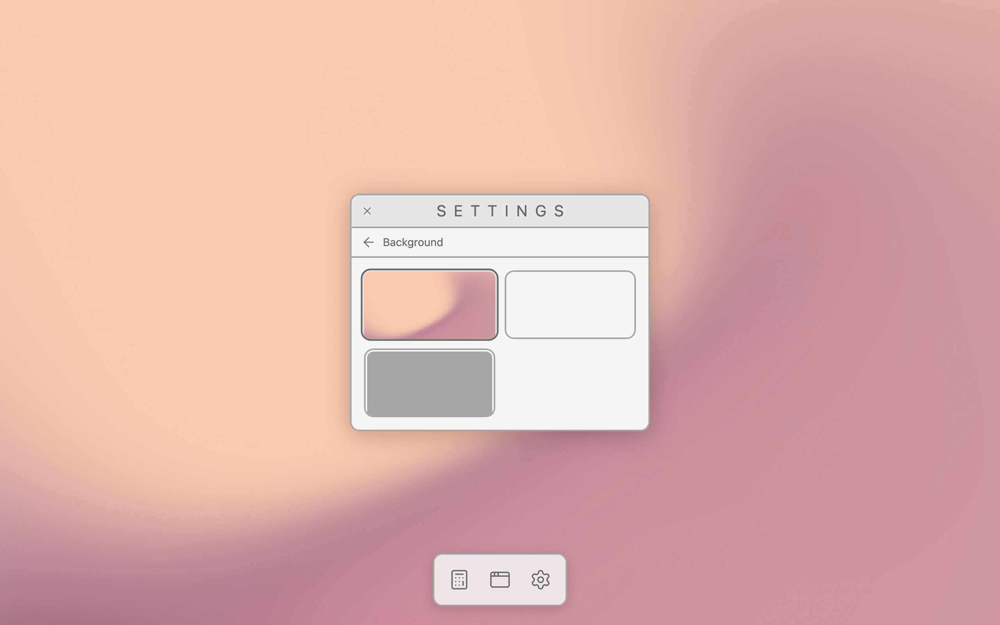

# A wallpaper the user can change

Branch `feat/wallpaper`. Makes the dock's Settings icon live: Settings opens, and its Background
page changes what the desktop is drawn on.

## Need

The desktop has a wallpaper, and the user can change it. Clicking Settings in the dock opens the
Settings window; its home shows the options the reference has — **Background**, and **Language**
disabled; Background shows the available wallpapers; clicking one changes the desktop behind every
window, at once, and the choice is still there after a reload.

It's next because the dock has had a dead icon since it was built, and because it asks the engine a
new kind of question. Everything the engine has drawn so far is a DOM element. A wallpaper is the
first thing on the desktop that is *not* one.

## Design

### The wallpaper is scene

**Decided: the engine draws the wallpaper. The whole desktop is a canvas.**

The other option was chrome — a CSS background behind a transparent canvas, which is what the
reference does (`background-image` on `.main-layout`) and what the canvas's own `bg-muted` class
does today. It is cheaper, and by [ADR 006](../decisions/006-the-dock-is-chrome-over-the-canvas.md)'s
test (a position the user changes, an order, a lifetime) a wallpaper is not a drawable. But that
test answers "is it a drawable *item*", not "is it drawn". The point of this project is a desktop
drawn through the canvas, and the pixel behind the windows is part of that desktop: if the canvas
does not own it, a screenshot of the canvas is not a screenshot of the desktop, and a camera later
would pan the windows over a page that stays still. So the background is the engine's, and it gets
an ADR ([008](../decisions/008-the-engine-draws-the-background.md)) because it is the first non-DOM
thing the engine draws and the first time ADR 006's line is drawn the other way.

**What the engine gains — all of it:**

```ts
interface Engine {
  /**
   * What the canvas is covered with before any item is drawn. A CSS color — whatever `fillStyle`
   * takes — or an image, drawn to **cover**: scaled to fill, aspect ratio kept, centred, cropped.
   * `null` leaves the canvas transparent, which is what it was before.
   *
   * The engine does not load anything: an image arrives already decoded.
   */
  setBackground(background: string | CanvasImageSource | null): void;
}
```

In `render()`, its own step between the clear and the items loop. Setting the same value again does
nothing; a new one is one `schedulePaint()`. It is not an item: it is not in the ordered list, it
can't be raised, picked or removed, and it has no element. Keeping it one small step of the pass is
also what a wallpaper that *moves* would drive later; nothing here loops.

The cover fit is the engine's, in backing-store pixels like the rest of the pass, so a 2× display
crops the same box out of a twice-as-sharp image. Loading is not: the host hands over a decoded
image, because a half-loaded one drawn here is a frame of nothing.

**The binding:** `<CanvasSurface background="…">`, one prop, one effect calling
`engine.setBackground`. The desktop drops `bg-muted` from the canvas, because that class *is* the
chrome version of this feature.

### Which wallpapers exist

Three: the real one, and two greys.

- **Field** — the wallpaper the owner supplied (`apps/shell/src/assets/wallpapers/field.svg`), a
  2048×1506 SVG: a soft peach-to-mauve gradient with a 256px film-grain pattern over it at 3%,
  `mix-blend-mode: overlay`. The file also carried a "Zephyr" text layer with its drop-shadow filter; the owner had it removed,
  and nothing else in the file is touched or re-encoded. Imported through Vite as a URL. It is the
  default.
- **Light grey** and **Mid grey** — stand-ins, kept because they are the cheapest way to see a
  change happen: the shade the desktop was before it had a wallpaper (`--muted`, written out as
  `#f5f5f5` because canvas `fillStyle` does not resolve `var()`), and the window chrome's border
  grey `#a6a6a6`.

They live in `apps/shell/src/backgrounds.ts` (the reference's `constants/backgroundConstants.ts`,
which has two). A wallpaper is `{ id, label, color }` or `{ id, label, src }` — a flat fill or a
picture — and that is the whole model. Nothing here is an object with layers.

### Who owns the setting

- **Which wallpaper is chosen is the desktop's state** — React state in `App.tsx`, saved to
  `localStorage` under the reference's key, `desktopBackground`, and read back at startup. It is a
  setting, not geometry: it is fine in React, and the engine is only told what to cover with.
- **Loading is the desktop's too.** `backgrounds.ts` creates the `Image`, awaits `decode()` and
  keeps it; the engine is handed the decoded image. Not the binding: `packages/react` is a thin
  binding and this is app knowledge (which wallpapers exist, which one was stored, which decodes are
  worth keeping). The desktop keeps the wallpaper already on screen until the next one is ready, so
  switching never shows a gap, and the *initial* one is awaited in `main.tsx` before the desktop is
  mounted at all — a dock and a window over a blank canvas is a flash of a desktop that never
  existed. It is a decode of a bundled asset, not a download.
- **The Settings app cannot reach the engine, and must not.** An app fills a content slot
  ([ADR 004](../decisions/004-window-chrome-belongs-to-the-desktop.md)); the reference's Settings
  pokes `.main-layout`'s style directly, which is exactly what that ADR forbids. The desktop hands
  apps a small context (`apps/shell/src/desktop.ts` — the available backgrounds, the current one, a
  setter), and Settings is its first consumer. The desktop is the OS and Settings is an app asking
  it for something.

### The Settings app

From the reference's [`SettingsApp`](https://github.com/0xFrann/desktop-os-react-next/blob/main/src/components/apps/SettingsApp.tsx),
**what it is, not how it looks**:

- **Home:** a grid of options. **Background** opens the Background page. **Language** is shown
  disabled and does nothing, as in the reference. `ActivateWallet` is in the reference's enum and
  never rendered; it is not ported.
- **Background page:** a back control, the title "Background", and one selectable thumbnail per
  wallpaper — the actual wallpaper at thumbnail size, the same image or the same flat color the
  engine draws. Clicking one sets it.

The look is this desktop's own, and it is **one system**: every control on the desktop — a dock
icon, a window's close button, Settings' options, its back control, its thumbnails — is the same
`control` (a Tailwind utility in `apps/shell/src/index.css`, fed by four variables):

- **One wash.** Hover is `--control-wash`, the chrome's foreground at 16% alpha, not a fixed grey.
  The dock is translucent, so a fixed light grey (`--window-header`, what the dock used before)
  all but vanished once the wallpaper behind it stopped being light grey; a wash that *darkens what
  it sits on* reads on the dock over any wallpaper and on a window alike. Checked on all three.
- **One scale, one curve.** `--control-scale` (1.1; a large surface like a thumbnail turns it down to
  1.05), `--control-duration` 150ms, `--control-ease`. The close button had no hover at all and now
  has this one; the reference's close glyph is replaced by lucide's `X`, and every icon is drawn at
  the same 1.5 stroke in `--window-foreground`, which is what made the back arrow look darker than
  the rest.
- **One focus ring and one disabled state**: dotted `--window-border`, 35% opacity.

That transition is not free inside a window, and it is paid on purpose. The dock is not drawn, so
its hover costs the canvas 0 paints; a control inside a window is part of a snapshot, and every
frame of a CSS transition is another one: hovering a thumbnail or the close button costs **10–11
paints** where an instant change cost 1–2. It is bounded — 150ms, only while the pointer crosses a
control — and idle stays at **0 paints/s**. A control that answers differently depending on where
it lives is not one desktop, so coherence wins over the ten paints.

The current wallpaper is marked — `aria-pressed`, drawn as the chrome's border one shade stronger
(`--window-foreground`) over the same wash. The reference marks nothing, but its thumbnails are
photographs of different scenes; two of these are flat greys.

`apps/shell/src/apps/Settings/`, and `dockApps.tsx` loses the `disabled` flag on Settings.

### Window sizes follow the viewport

Settings is the feature that needs per-app window sizes — it is the reference's `Small`, its content
is a grid, and every window here is a fixed `w-sm` (384px). This was left out twice; here it is
needed, so it is built here and only this big.

From the reference: the *set* of sizes and which app gets which. **Decided: the measurements are
this desktop's own, and relative to the viewport**, because the desktop has to work on more than one
screen. Each side is a `clamp()` — a share of the viewport between a floor and a ceiling — and the
numbers say the same thing in CSS and in JS, from one place (`WINDOW_SIZES` in `Window.tsx`):

| Size | Width | Height | At 1280×800 | Apps |
|---|---|---|---|---|
| small | `clamp(320px, 30vw, 460px)` | `clamp(260px, 38vh, 420px)` | 384 × 304 | Settings (reference), Counter (not in the reference; the smallest there is) |
| medium | `clamp(384px, 42vw, 600px)` | `clamp(280px, 46vh, 500px)` | 538 × 368 | Example App (reference) |
| large | — | — | — | nothing yet — it is Example Two's, which belongs to the icon grid. Not built. |

384px at 1280 is the width every window in this repo has had; the share keeps it following the
screen from there. The floors are what a title needs to fit on one line ("EXAMPLE APP" at the
header's `0.5em` letter-spacing measures 384px of window) and what keeps a window whole on a narrow
viewport; the ceilings keep a window from becoming a wall on a large one.

The size is CSS on the frame, so it is the DOM's: the mount is laid out by the page inside the
canvas, a viewport resize re-lays it out, and Chrome fires `paint` by itself. The engine still does
not know a size. The shadow band stays in pixels (it is the shadow's measured size, not the
window's), and so does the cascade step.

**Where a window opens** changes with it: fixed `(228, 152)` is wrong for a window that is a share
of an unknown viewport. **The first window is centred on the desktop, and later ones cascade from
*that* window's corner** by a header's height (44px), still taking the lowest free step. The cascade
runs from one shared corner rather than from each window's own centred spot because the windows are
different sizes: centred, a medium window's top edge sits half the size difference above a small
one's, and on screen that was enough for the second window to land exactly on the first one's header
and hide it completely (measured below). The desktop computes that once, at open time, from the
viewport and the window's size; from then on the position is the engine's, as before.

### Not here

- **An animated wallpaper** — the next feature. Nothing here loops, and the background is one step
  of the render pass so that a feature which has to change it per frame has one place to drive.
  What moves, at what rate, and whether it costs the idle desktop its 0 paints/s is its own design.
- Keeping a window on screen when the viewport shrinks after it was opened, or when it is dragged
  out: nothing clamps a position, as before.
- Language, or any other Settings page. The `large` size. Minimize, resize by the user.
- More than one wallpaper image, anything that scrolls or tiles a background, and any background
  object model. A fill or an image, drawn to cover.
- The dock stays chrome ([ADR 006](../decisions/006-the-dock-is-chrome-over-the-canvas.md)). "The
  whole desktop is a canvas" reopens that decision; it is reopened in its own feature, not here.

## On screen

> The pointer-driven paint counts below (a mouse click on a thumbnail, Background, the back arrow)
> were measured before the controls shared one hover transition. With it, a pointer crossing a
> control inside a window adds the transition's frames: clicking **Background** reads **11 paints**
> instead of 2, hovering a thumbnail **11**, hovering the close button **10**. The keyboard-driven
> counts, the engine's 1 paint per wallpaper change, and **idle = 0** are unchanged.

Chrome for Testing 153 (`--enable-blink-features=CanvasDrawElement`), `pnpm screenshot`, 1280×800
and DPR 1 unless a run says otherwise. Windows at 1280×800: Counter's mount at `412 216 456 376`
(frame `448 248`, 384×304), Example App's at `456 260 610 440`, Settings' at `500 304 456 376` —
the mount is the frame plus the shadow band (36 sides, 32 top, 40 bottom), so a frame is 36/32
inside its mount.

| The desktop is the wallpaper | Settings, from the dock | The Background page | Switched to a grey |
|---|---|---|---|
|  |  |  |  |

| Three windows, cascaded | 800×600 | Resized under them | 1920×1080 |
|---|---|---|---|
|  |  |  |  |

| Kept across a reload | Dragged and raised | DPR 2 |
|---|---|---|
|  |  |  |

1. **The desktop's pixels come out of the canvas.** The canvas element's computed
   `background-color` is `rgba(0, 0, 0, 0)` — `bg-muted` is gone — and `getImageData` on the empty
   desktop reads the wallpaper: `#fac8ad` at (40, 40), `#dda9a5` at (1240, 40), `#cd909f` at
   (640, 760). On the mid grey it reads `#a6a6a6` at every one of them. The canvas is not tainted by
   `drawElementImage` or by an SVG background, so this is a read of the real surface.
2. **Nothing is ever drawn but the wallpaper.** Sampling on the canvas's own `paint` event, from
   the first frame of the document: the engine's **first render already has the wallpaper on it**
   (one entry, `rgba(197,147,156,255)`), and after a reload with a grey stored, its first render is
   `rgba(166,166,166,255)`. No render with the other wallpaper, and none with an empty canvas. Two
   things get that: the initial image is awaited in `main.tsx` before React mounts anything, and the
   binding creates the engine in a **layout** effect, so the canvas is never handed to the browser
   before the engine knows what to cover it with.
3. **Changing the wallpaper costs the engine exactly 1 paint.** Measured with the keyboard, which
   moves nothing else: Tab to a thumbnail, Enter → **1 paint** and the desktop changes; Enter again
   on the same one → **0 paints**. With the mouse it is **2**: that 1, plus 1 for the window's own
   repaint as the thumbnail takes the hover and the mark. Clicking the wallpaper that is already on
   → **0**.
4. **Idle is 0 paint events per second**, before and after every run above, with the image
   wallpaper showing and up to three windows open. The wallpaper is drawn in the paint pass and
   nothing re-asks for it.
5. **The choice survives a reload.** Pick Mid grey, reload: the desktop comes back mid grey
   (`#a6a6a6`), **0 paints** in the 500 ms after it settled, and no window is open — the desktop
   remembers the setting, not the session.
6. **Settings opens from the dock and its pages work.** The icon is no longer dimmed; one click
   opens the window (**2 paints**, the same as any window). Background → the page (**2 paints**),
   back arrow → the home (**2 paints**). Clicking the disabled **Language** costs **0 paints** and
   navigates nowhere; the one run where it read 1 was the focus leaving the control clicked before
   it, and clicking Language twice in a row is 0 and 0.
7. **Tab stays inside Settings and walks its controls.** With the Background page open: Close →
   Back → Field → Light grey → Mid grey → Close again, wrapping, **1 paint** each (the focus ring),
   and never the dock or the window behind. Shift+Tab walks back.
8. **Ctrl+` visits all three windows and comes back** — the first time three have been open at
   once. From `Counter z0 | Example z1 | Settings z2`: press → `Example | Settings | Counter`,
   press → `Settings | Counter | Example`, press → back to `Counter | Example | Settings`. **1
   paint** each.
9. **`vw`/`vh` resolve against the viewport inside a `layoutsubtree` canvas.** A small window's
   mount measures `456×376` at 1280×800 (384 + 72 of band, 304 + 72), `392×332` at 800×600 (the
   floors: 320 + 72, 260 + 72) and `532×482` at 1920×1080 (the ceilings). The page lays the mount
   out and the engine draws whatever it turned out to be.
10. **A resize re-lays out and repaints with no engine call.** With two windows open, going from
    1280×800 to 800×600 costs **1 paint**: the backing store becomes 800×600, both windows shrink
    to their floors, the wallpaper re-covers the new canvas — and `apps/shell` calls nothing. The
    engine's own `ResizeObserver` asks for that paint. The windows keep their positions, so they end
    up hanging off the right edge: nothing clamps a position, as before.
11. **Windows open centred, on screen, at both viewports, and every header is grabbable.** At
    1280×800 three windows open at mounts `412 216`, `456 260`, `500 304` — 44px apart, a header
    (42px) plus two. At 800×600: `204 138`, `248 182`, `292 226`, all inside the viewport. Titles
    fit on one line at both: `COUNTER`, `EXAMPLE APP`, `SETTINGS` — the floors were raised to 320
    and 384px for exactly that, after 300/340 trimmed all three at 800×600.
12. **The cascade bug this found.** Cascading from each window's *own* centred position put the
    Counter's mount at `265 128` and the Example window's at `260 128` — 5px apart, the second
    exactly on top of the first, because half the size difference (45, 40) cancelled the step. From
    one shared corner it cannot happen, whatever sizes exist.
13. **The shadows are still complete.** On the flat mid grey (`#a6a6a6` = 166), straight down from
    a frame's bottom edge, the canvas reads 143, 145, 148, 152, 157, 162, 165, 166 at 1, 3, 6, 10,
    16, 24, 34 and 44 px below it — a fade that reaches the wallpaper before the band ends, not a
    step. The band is in pixels and the window is not, and at these sizes that is still right.
14. **Cover, at three shapes of screen.** The wallpaper is 2048×1506 (1.36); the canvas is 1.6 at
    1280×800, 1.33 at 800×600 and 1.78 at 1920×1080. At all three the corners read wallpaper, not
    canvas — `#fac8ad` top left and `#cf96a2` / `#cf969f` bottom right at the narrow and wide ones —
    so it fills without letterboxing, and the aspect ratio is kept (the crop is vertical at 1280×800,
    horizontal at 800×600).
15. **The grain is really there.** A 48×48 region of the wallpaper reads mean 208.33, **sd 0.257,
    average step between neighbouring pixels 0.264**; another reads sd 0.554 / step 0.528. The same
    region on the flat grey reads **sd 0.000, step 0.000**, which is the control. And the spread
    being the same size as the per-pixel step is what says it is texture and not a ramp: a smooth
    gradient with that step across 48px would read a spread of about 12.
16. **DPR 2 is the same.** Backing store 2560×1600, the same mount rects in CSS pixels, the same
    paint counts, the same wallpaper colours within a unit of resampling, and the grain survives
    (sd 0.337 / step 0.272 on the same region).
17. **Drag, raise and close still work at the new sizes.** With Counter and Settings open, dragging the Settings window's header
    `700,310 → 800,560` lands its mount at `556 510` — the start plus the pointer delta exactly —
    for 27 `pointermove` and **25 paints**, the cost a drag has always had. A press on the Counter's
    exposed frame at (460, 400) raises it (**1 paint**, `z-index` 1) and hit-testing follows:
    (460, 400) → Counter, (850, 600) → Settings. A third dock click on an open app raises it
    (**1 paint**), and its close control closes it (**1 paint**), leaving the other window alone.

Tooling: `pnpm screenshot` gained **`PIXEL_AT`** (read the canvas's own pixels back),
**`REGION_AT`** (a region's mean, spread and average step between neighbouring pixels — "is there
texture in there"), **`TRACE_AT`** (what every render left at a point, from the first frame of the
document), **`RESIZE`** and **`RELOAD`**, and `Enter` now really presses the button it is on
(a CDP `rawKeyDown` runs no default action). It also refuses to run when something is already
debugging on its port — every run for an hour had been quietly borrowing a browser, and a profile,
that a run two hours earlier had left behind — and closes the browser it opened.
