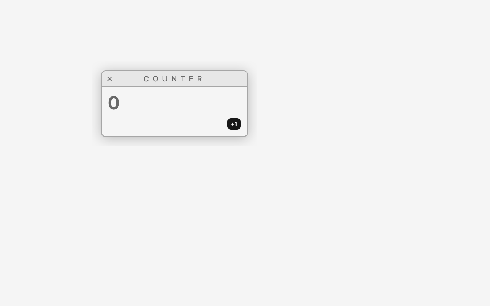
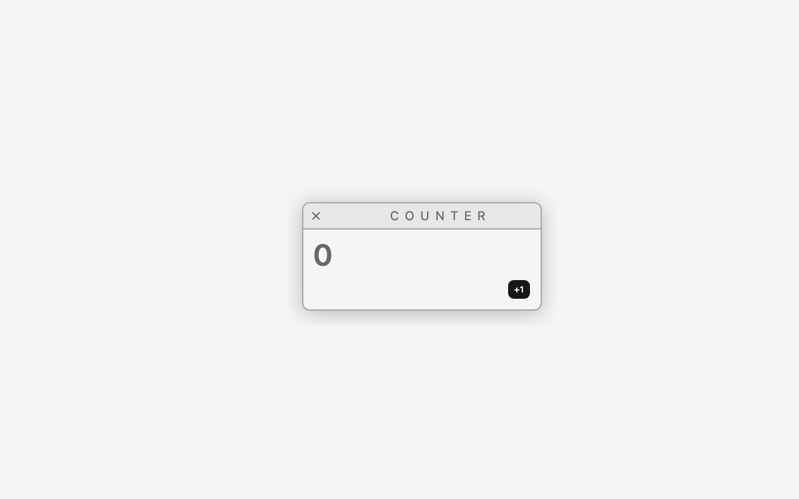
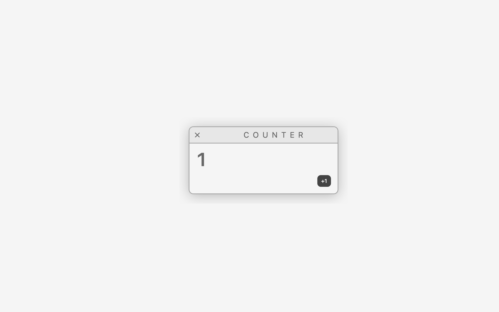

# A window with a draggable header

Branch `feat/window-draggable-header`. Merges what the roadmap listed as two features — dragging the modal by
its header, and giving it the reference desktop's window chrome — because the first one needs the
second to be honest: a header is what a window has.

## Need

Grab the window's header, move the mouse, and the window follows — pixels *and* clicks. Releasing
it leaves it where it was dropped, and "+1" still increments from there. It's next because it is
the first time a position changes many times a second, which is what forces the answer to: **how is
repaint driven?** So far the canvas has repainted because Chrome noticed a drawable child
re-render ([counter modal](./counter-modal.md)). A drag changes no DOM in the content — only a
number the engine holds — so the engine has to ask for the repaint itself, at the right rate.

The chrome is part of the same need, not decoration. Dragging a Base UI `DialogHeader` meant the
grab area was one line of text with the popup's padding around it — thin, with dead margins — and,
worse, it meant the *app* decided it could be dragged. In an OS, an app never can: the desktop hands
it a window, and the window's header is what drags.

## Design

**The desktop provides the window; apps get a content slot.**
([ADR 004](../decisions/004-window-chrome-belongs-to-the-desktop.md).)

- `apps/shell/src/components/Window/` is a React component of the desktop, not of the engine and not
  of the binding — the engine has no window concept and never will have one at this level. It takes
  `title`, `initialPosition`, an optional `onClose`, and `children`. It renders the `<Drawable>`, the
  header, and the content area; `children` lands in the content area and nothing else.
- `CounterModal` therefore imports nothing from `@os-canvas/react` any more: it is a number and a
  "+1" button. The Base UI Dialog goes away with it (`components/ui/dialog.tsx` too — nothing else
  used it), and with the Dialog goes the portal that made the drag handle appear a commit late.
- **`useDragHandle` is chrome-only.** It stays exported from `@os-canvas/react` — the binding has to
  expose the engine's primitive to its host somehow — but `Window` is its only caller in the repo,
  and its JSDoc says so. An app has no element to attach it to anyway: it never renders the header.

**The header is the drag handle, the whole strip, edge to edge.** Layout is macOS-style, which is a
deliberate deviation from the reference (whose only control is pinned to the right):

- the top-**left** zone is reserved for the window's action controls — for now just close, which is
  all the reference has; minimize and zoom arrive with the features that need them;
- the rest of the strip is the app's area, and holds the window title by default. A spacer as wide as
  the reserved zone balances the other end, so the title centers on the window, not on what's left
  of it;
- any empty space in it drags, including the padding above and below the title and the far end of
  the strip.

**Engine: a press on an interactive element doesn't start a drag.** With the whole header as the
handle, the close button is inside the handle. So `attachDragHandle` ignores a `pointerdown` whose
target is, or is inside, a `button, a, input, textarea, select, [contenteditable]` — one `closest()`
check, no options object. Controls in the header keep working (a future toolbar included); empty
space drags.

**The look is ported from the reference, not redesigned.** `--windowBackground` `#f5f5f5`,
`--windowGrey` `#e7e7e7`, `--borderColor` `#a6a6a6`, `--bodyColor` `#686868` and
`--windowBorderRadius` `0.75rem` become CSS variables in `apps/shell/src/index.css`, exposed to
Tailwind through `@theme inline`; the 2px border, the `drop-shadow(0 4px 16px rgba(0,0,0,.25))`, the
header's `0.625rem 0.75rem` padding, the content's 2px top border, and the title's
`1.25rem / 0.5em letter-spacing / uppercase / line-height 1` come from `apps-window.scss` as they
are. The close glyph is the close half of the reference's `close-minimize.svg`, inlined (the other
half is minimize, which doesn't exist here yet).

### The drag itself

- **Who picks the thing being dragged: the DOM does.** The drawable content is real DOM inside the
  canvas and the engine already keeps its DOM rect on top of its drawn rect
  ([modal position](./modal-position.md)), so `pointerdown` lands on the header the user sees. No
  picking, no hit-test structure, no scene graph — those earn their place when something is drawn
  that is *not* a DOM element, or when two windows overlap.

- **The handle is registered with the engine, not handled in React.** The engine gets a method on a
  drawable item:

  ```ts
  item.addDragHandle(handle: HTMLElement): () => void
  ```

  It attaches `pointerdown` to that element and owns the whole gesture: grab point, pointer
  capture, `touch-action: none`, the delta math, `moveTo`, and teardown. The returned function
  detaches. React's binding is one hook, next to `useDrawableMount()`:

  ```ts
  const handleRef = useDragHandle<HTMLDivElement>();   // <div ref={handleRef}>  the header
  ```

  The hook only hands the engine an element. No component sees a coordinate, and no position ever
  touches React state — during a whole drag React does not re-render at all.

- **The math.** `pointerdown` records the pointer's client point and the item's current position;
  each `pointermove` sets `start + (client − origin)`. Deltas are translation-invariant, so the
  canvas's own offset on the page does not enter the formula (a zoom/camera would, and that is
  where this gets revisited).

- **How repaint is driven — the thing this feature exists to answer.** Three candidates:

  1. `requestPaint()` on every `moveTo`. One request per `pointermove`, and a mouse can move more
     than once per frame, so a frame can carry several redundant requests.
  2. A frame loop: `requestAnimationFrame` coalescing, at most one `requestPaint()` per frame.
  3. **Dirty flag cleared by the paint event**: `moveTo` marks the engine dirty and calls
     `requestPaint()` only if no paint is outstanding; the `paint` handler clears the flag as it
     draws. The browser's own paint cycle *is* the frame loop, so the engine never runs a loop of
     its own and never queues work behind one.

  (3) is the design, because it keeps the rule the project already found — Chrome drives paint, the
  engine only says "something changed" — and needs no rAF. Its risk is real: if a `requestPaint()`
  ever fails to produce a `paint` event, the flag never clears and the drag freezes. That, the
  actual paint rate under a drag, and whether writing the CSS transform each paint feeds back into
  another paint (a free-running loop) are measured on screen below, and decide whether (2) comes
  back.

- **`position` becomes `initialPosition`.** `<Drawable position>` had an effect pushing prop
  changes into `moveTo`, which is a second owner of the position: after a drag the prop is stale,
  and any re-render with a different literal would snap the window back. The prop now seeds the
  item at registration and nothing else; the engine owns the position from then on.

- **Files.** `packages/engine/src/drag.ts` (gesture + math, and the interactive-target check),
  `packages/engine/src/index.ts` (`addDragHandle`, dirty-flag scheduling),
  `packages/react/src/Drawable.tsx` (`useDragHandle`, `initialPosition`),
  `apps/shell/src/components/Window/Window.tsx` (the chrome),
  `apps/shell/src/apps/CounterModal/CounterModal.tsx` (content only now),
  `apps/shell/src/index.css` (the ported variables), `App.tsx`,
  `scripts/screenshot.mjs` (a `DRAG` option and paint-event counters).

Not here: z-order, more than one window, minimize, zoom, resize, or a window manager. `onClose` is a prop
the desktop doesn't pass yet — there is nowhere to close into until the dock can reopen an app.
Bounds, too: the window may be dragged off the edge, and nothing clamps it yet.

## On screen

Chrome for Testing 153 (`--enable-blink-features=CanvasDrawElement`), 1280×800, `pnpm screenshot`.
The window starts at (240, 160); the mount's padding puts the frame at `264 184 384 174`, its header
at `266 186 380 40` and the close control at `272 192 28 28` — a 28px hit area around a 16px glyph
(the reserved zone is the reference's 3rem; the button grows outward from the same center). Every
drag below moves the pointer by (+220, +140).

| The window | Dragged by the far right end of the header | "+1" clicked where it now draws | The same at DPR 2 |
|---|---|---|---|
|  |  |  |  |

1. **The chrome is the reference's.** Grey header strip, 2px `#a6a6a6` border, `0.75rem` radius,
   `#f5f5f5` body, the spaced uppercase title, the 2px line under the header, the drop shadow — the
   values ported from `apps-window.scss`, arranged macOS-style: close at the top left, title in the
   app's part of the strip. The shadow survives the trip through `drawElementImage` because the
   mount keeps padding around the frame for it.
2. **Any empty pixel of the strip drags, including the ends.** `636,206` — the far right of the
   header, past the title, where the old dialog had nothing but dead margin — drags the window to a
   mount rect of `460 300 432 222`, exactly the start plus the pointer delta. So does `450,190`, the
   padding *above* the title, and so does the title text itself at `490,206`: all three land on
   `460 300`.
3. **The close control is not a drag start.** Pressing at `286,206` and moving the same (+220, +140)
   leaves the mount at `240 160 432 222` and costs **0 paint events** — the engine never started a
   gesture, because `pointerdown` came from inside a `button`. Same at DPR 2, and same from both
   corners of the enlarged box (`274,194` and `299,219`), while a press 2px outside it (`302,206`)
   drags. A rounded corner on the button lost the first corner test: the browser hit-tests the
   rounded shape, so the button has none. The press still reaches
   the control: with `onClose` temporarily wired to a `console.log`, clicking it logs, and the window
   stays where it is. Nothing is wired to it in the shell yet — there's nowhere to reopen an app from
   until the dock exists.
4. **Pixels and clicks move together.** After the drag, `CLICK_AT="832,464"` (the "+1" button where
   it is now *drawn*) turns the DOM text into `Counter1+1` and the canvas shows **1**. At `DPR=2` the
   same run gives the same mount rect and the same **1** on a 2560×1600 backing store: positions stay
   in CSS pixels and only the draw call multiplies by DPR, as the
   [position feature](./modal-position.md) established.
5. **Repaint driving, answered: the browser's paint cycle is the frame loop.** A 24-step drag paced
   8 ms apart produced 25 `pointermove` and 25 `paint` events in ~720 ms — one paint per move, each
   `requestPaint()` answered before the next move arrived. Pushing the pacing to 0 ms gives 61 moves
   and 61 paints in ~1.3 s (≈46/s, the browser's own rate) and the window still lands on the exact
   pixel, because the last move wins and the engine reads the position at paint time. Every
   `requestPaint()` was followed by a `paint` event at every pacing tried — the freeze the dirty flag
   risks never happened — so the engine still has no `requestAnimationFrame` loop of its own.
6. **Idle is idle: 0 paint events per second**, before every run above. The engine only writes
   `element.style.transform` when the value actually changed; without that guard, the style write on
   a drawable child is itself a reason for Chrome to fire `paint`, which is a free-running repaint
   loop. (A single "+1" click costs 10–11 paint events — hover, press, focus ring, the new number.
   That is Chrome's own repaint policy, not the engine's.)
7. **The DOM rect cannot lag the drawn rect**, by construction: it is written from the matrix that
   same draw returned. Sampled mid-gesture in the earlier build, the mount read
   `transform: matrix(1, 0, 0, 1, 460, 300)` with its DOM rect at `460 300` and the pointer still
   over the header it grabbed. And since the snapshot is recorded before transforms, moving the
   element never changes what is drawn — no flicker from writing it every frame.
8. **The expensive surprise was React's, not the browser's**, and the window design removed it: a
   hook that hands out a ref *object* never sees a portalled handle, because Base UI mounted the
   dialog popup a commit after the drawable registered. `useDragHandle` returns a callback ref for
   that reason, and now that the header is plain chrome the portal is gone entirely. The tell is
   still useful: the handle's `style.touchAction` reads `none` only once the engine has taken it.

Tooling unchanged this time: `pnpm screenshot` already had `DRAG="x1,y1:x2,y2"` (press,
`DRAG_STEPS` interpolated moves `DRAG_STEP_MS` apart, release — before any `CLICK`), `CLICK_AT`,
`DPR`, and the `paint`-event counters, idle first and then over the gesture.
